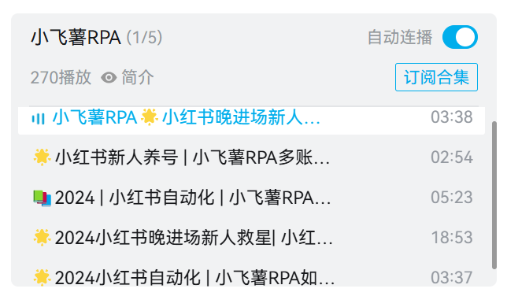

# :two_hearts:小飞薯RPA基本介绍

🌟 小红书晚进场新人救星！✨ 新人养号必备！🔑专注小红书自动化！

📱 小飞薯RPA是一款紧贴小红书优质用户规则开发的自动化软件，避免了传统RPA机械化、规则化、易被检测的问题。💡 软件易上手，运行方式简单，功能强大。💪

更多视频演示：

[小飞薯RPA🌟小红书晚进场新人救星！✨ 新人养号必备！🔑专注小红书自动化！_哔哩哔哩_bilibili](https://www.bilibili.com/video/BV1ep8oeJEww/?spm_id_from=333.999.0.0&vd_source=0ad5d97e690d971211839f275274ce02)

[🌟小红书新人养号 | 小飞薯RPA多账号演示📱_哔哩哔哩_bilibili](https://www.bilibili.com/video/BV1yqh6eZE1w/?spm_id_from=333.999.0.0)

# :heartbeat:小飞薯RPA软件功能

- [x] 自动活跃账号（观看笔记/评论、点赞笔记/评论、收藏笔记)
- [x] 自动精准评论
- [x] 自动流量换量（完成双向奔赴、抱团取暖等操作）
- [x] 自动发布笔记

# :sparkling_heart:小飞薯RPA软件亮点

- 安装简单：仅需简单几步操作就能完成部署，打破技术壁垒，不懂计算机的小白也能轻松使用
- 轻量化：专注小红书自动化，避免无用/无关/无效内容导致的软件臃肿，软件体积小、占用资源少，轻松实现托管养号
- 功能强大：模块化设计，具备观看、点赞、收藏、换量、发布等一系列功能，彻底结束四处求赞、四处评论活跃账号的网络流民生活
- 不易检测：完全模拟真实用户操作，并带有技术手段规避检测措施，拒绝机械化，规避传统自动化软件特征明显、易被检测的问题
- 规则精确：基于小红书流量规则，通过分析广大优质用户行为习惯，结合小红书专业运营师多年养号、陪跑经验而设计的高度贴合小红书优质账号规则，让用户更专注于优质内容创作
- 优质社群：构建新人优质社群，更加适合晚进场新人小白之间交流互助，扩展你的小红书人脉
- 更新活跃：直面软件开发者，手把手教你安装、使用，有问题1对1解决，有bug、有需求、有想法均能及时反馈，并不断增加新功能

# ❓小飞薯RPA问答专区

Q：小飞薯RPA能否增加我笔记的流量？

A：小飞薯RPA是一款小红书自动化软件，这并不意味之能给你带来流量（流量规则是小红书定的，用户不得干预），但是结合我们的优质社群，你能够更好地进行流量换量（即双向奔赴、抱团取暖），那么从这个角度来说，是可以增加你笔记的流量的。

Q：小飞薯RPA内置的规则是否合理，会不会导致账号限流？

A：内置规则是通过技术手段分析小红书流量趋势、通过专业运营师经验总结、通过大量账号实践而设计的，并且不断保持更新，在遵循《小飞薯RPA使用手册》的前提下不会导致限流。

Q：小飞薯RPA有无安全问题，会不会导致账号被盗？

A：小飞薯RPA通过用户手机扫码登录，中途不涉及密码输入，且账号数据保存在用户设备本地并定时清除重置，此外还使用设备一机一码绑定机制，无法转载传播使用，没有任何账号泄露问题。

Q：使用小飞薯RPA会不会被检测，导致封号？

A：小飞薯RPA通过模拟真实点击实现自动化，和真人特征高度吻合，且无任何刷取流量的违规操作，符合小红书用户守则，仅仅只是一个快捷工具，不存在封号问题。

Q：我的小红书已经违规被限流了，能通过小飞薯RPA养号养回来吗？

A：根据小红书用户规则，限流程度取决于违规程度，如果是轻微违规所导致的限流，是可以通过养号提升账号权重的，但如果是严重违规所导致的限流，无论是人工养还是软件养，都是无法通过养号养回来的。再次申明，小飞薯RPA只能帮您完成自动化操作。

Q：小飞薯RPA多用户版本和单用户版本有什么区别？

A：单用户版本只能养一个号，多用户版本可以养多个号。

Q：使用多用户版本的小飞薯RPA，但我只开一个号的话会有什么问题吗？

A：没有任何问题。

------

更多问题？请看视频解答：

[🌟2024小红书晚进场新人救星| 小红书自动化 | 小飞薯RPA详细介绍📱_哔哩哔哩_bilibili](https://www.bilibili.com/video/BV1xehSeQEKf/?spm_id_from=333.999.0.0)

# :heartpulse:小飞薯RPA软件获取

🐧交流群：`979372676` ，~~前`10`名小伙伴免费获得软件，群等级 `Lv60` 以上（包括`Lv60`）也可以免费拿软件（单用户版本/多用户版本小飞薯RPA任选）~~

> 目前，前`10`名小伙伴免费试用名额已经全部发放完成。
>
> 此外，有部分小伙伴反映【群等级 `Lv60` 以上】太难了，现删除此规则，想要免费试用的小伙伴可以按照新的规则（任选其一即可）：
>
> 1. 访问我们的BiliBili小飞薯视频合集，如下
>    [🌟2024小红书晚进场新人救星| 小红书自动化 | 小飞薯RPA详细介绍📱_哔哩哔哩_bilibili](https://www.bilibili.com/video/BV1xehSeQEKf/?spm_id_from=333.788&vd_source=0ad5d97e690d971211839f275274ce02)
>
>    视频合集存放的是小飞薯RPA软件介绍、更新、演示等系列视频，__任选3个或3个以上视频，每个视频做【点赞 + 投币 + 收藏 + 评论或弹幕（小飞薯yyds！）】操作，截图联系群主__，即可获得免费试用
>
> 2. __在抖音、快手、微信视频号、西瓜视频、今日头条发布我们小飞薯的1个宣传视频（宣传视频群里文件有名为【宣传视频.zip】，解压即可获得），持续曝光两日及以上__，并在描述栏目添加如下描述：
>
>    - 项目地址
>    - gitee（国内）：https://gitee.com/Jici_Zeroten/XiaoFeiShu
>
>    - github（国外）：https://github.com/Jici-Zeroten/XiaoFeiShu
>
>    - 小飞薯RPA交流群：979372676
>
>    截图联系群主，即可获得免费试用
>
> 3. __转发小飞薯的宣传文案【项目截图 + 项目地址 + 文字描述 】至2个或2个以上人数达到50人的群聊（QQ、微信、钉钉、飞书均可，广告群不算），截图联系群主__，即可获得免费试用。类似下图
>
>    

如果不想要活跃群去获得软件，当然可以走捷径，`小飞薯RPA(单用户版本)`捐赠 `30` ，`小飞薯RPA(多用户版本)`捐赠 `50`，价格随人数上涨而上涨，定价只是为了筛选从而打造优质社群，后续本人有时间软件会继续更新。

# :shaved_ice:捐助码

小飞薯RPA的开发也是倾注了我很多精力的，一开始只是为了自己使用方便，因为这样能够把更多的时间花在优质内容创作上，之后发现帮了我很多忙，觉得挺好用的于是决定分享出来大家一起用！

> 毕竟在平台上发还是要按照平台流量规则来，很多时候也许你的内容优质但是流量规则是机械的，这也导致新人小白很难立足，这也是我建立社群的初心。

## 微信

## 支付宝

# ❤️我们的用户&捐助特别鸣谢

排名没有先后之分，真心感谢各位支持！！！

| 捐助者       | 渠道   | 时间                 |
| ------------ | ------ | -------------------- |
| 一个梨子     | 微信   | 2024年07月1日 15:07  |
| Siau-love    | 支付宝 | 2024年07月1日 15:18  |
| 柔           | 微信   | 2024年07月1日 16:03  |
| u熙          | 微信   | 2024年07月1日 16:45  |
| 高小啵啵     | 支付宝 | 2024年07月1日 19:19  |
| 小蛇         | 微信   | 2024年07月2日 0:12   |
| RYRYRY       | 微信   | 2024年07月2日 13:05  |
| 薄荷不吃香菜 | 微信   | 2024年07月2日 17:47  |
| 不是山谷     | 微信   | 2024年07月3日 11:21  |
| 媛崽软糖     | 微信   | 2024年07月4日 2:56   |
| yuxin        | 支付宝 | 2024年07月4日 3:30   |
| 小鱼koi      | 微信   | 2024年07月4日 11:19  |
| 小许2.0      | 微信   | 2024年07月5日 23:05  |
| 航拍有你     | 微信   | 2024年07月6日 0:01   |
| 麦香鸡腿堡   | 微信   | 2024年07月6日 0:03   |
| _(呆呆)\_    | 微信   | 2024年07月6日 15:11  |
| liklik       | 微信   | 2024年07月7日 9:30   |
| 寄雪         | 微信   | 2024年07月8日 18:56  |
| Wency        | 微信   | 2024年07月9日 14:00  |
| 白白         | 微信   | 2024年07月9日 19:55  |
| Sea          | 支付宝 | 2024年07月10日 23:51 |