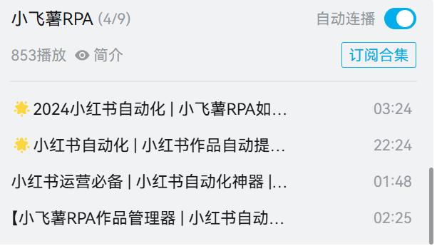
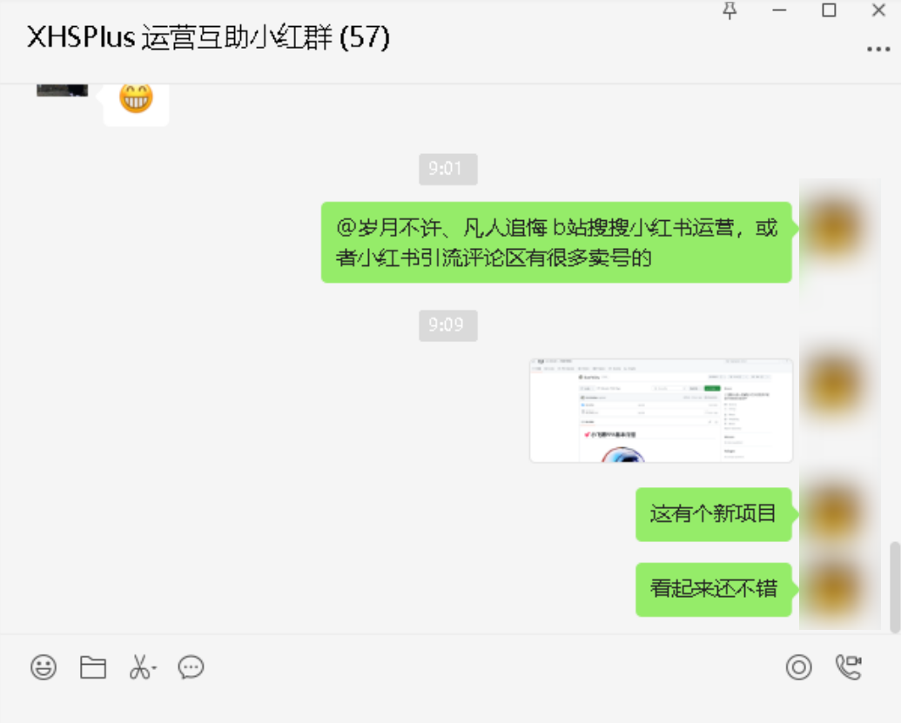

# :two_hearts:小飞薯RPA基本介绍

🌟 小红书晚进场新人救星！✨ 新人养号必备！🚀小红书运营自动化工作流解决方案！🔑专注小红书自动化！

📱 小飞薯RPA是一款紧贴小红书优质用户规则开发的自动化软件，💥提供了一套小红书运营自动化工作流解决方案，🎯避免了传统RPA机械化、规则化、易被检测的问题。💡 软件易上手，运行方式简单，功能强大。💪

更多视频演示：

- [小飞薯RPA🌟小红书晚进场新人救星！✨ 新人养号必备！🔑专注小红书自动化！_哔哩哔哩_bilibili](https://www.bilibili.com/video/BV1ep8oeJEww/)
- [🌟小红书新人养号 | 小飞薯RPA多账号演示📱_哔哩哔哩_bilibili](https://www.bilibili.com/video/BV1yqh6eZE1w/)
- [小红书运营必备 | 小红书自动化神器 | 小红书笔记自动提交_哔哩哔哩_bilibili](https://www.bilibili.com/video/BV1Ya8bezEr4/)
- [小飞薯RPA作品管理器 | 小红书自动化运营｜自带小红书热点分析｜你的笔记创作好帮手！_哔哩哔哩_bilibili](https://www.bilibili.com/video/BV1wsi7eTEte/?spm_id_from=333.999.0.0)
- [小飞薯RPA🌟轻松捕获小红书热点信息！🔑小红书优选标签！助力每一位小红书博主！_哔哩哔哩_bilibili](https://www.bilibili.com/video/BV1tcYmeWE2q/?spm_id_from=333.999.0.0)

# 🤖小飞薯RPA软件功能

✅ 自动活跃账号（观看笔记/评论、点赞笔记/评论、收藏笔记等操作)

✅ 自动精准评论

✅ 自动流量换量（完成双向奔赴、抱团取暖等操作）

✅ 自动发布笔记（支持定时发布、多账号笔记独立管理、笔记违规检测等操作）

✅ 小红书热点分析

✅ 小红书优选标签

# :sparkling_heart:小飞薯RPA软件亮点

- 安装简单：仅需简单几步操作就能完成部署，打破技术壁垒，不懂计算机的小白也能轻松使用
- 手册完备：配有详细的软件使用手册和对应的视频演示讲解，杜绝模棱两可，让你快速上手
- 轻量化：专注小红书自动化，避免无用/无关/无效内容导致的软件臃肿，软件体积小、占用资源少，轻松实现托管养号
- 无感化：软件运行在后台，养号全程无感，不影响日常设备正常使用，解决传统自动化软件霸占设备的短板，释放您的生产力工具
- 功能强大：模块化设计，具备观看、点赞、收藏、换量、发布等一系列功能，彻底结束四处求赞、四处评论活跃账号的网络流民生活
- 不易检测：完全模拟真实用户操作，并带有技术手段规避检测措施，拒绝机械化，规避传统自动化软件特征明显、易被检测的问题
- 规则精确：基于小红书流量规则，通过分析广大优质用户行为习惯，结合小红书专业运营师多年养号、陪跑经验而设计的高度贴合小红书优质账号规则，让用户更专注于优质内容创作
- 优质社群：构建新人优质社群，更加适合晚进场新人小白之间交流互助，扩展你的小红书人脉。社群分享小红书运营相关优质资料，帮助新人快速成长和了解行业动向
- 更新活跃：直面软件开发者，手把手教你安装、使用，有问题1对1解决，有bug、有需求、有想法均能及时反馈，并不断增加新功能

# ❓小飞薯RPA问答专区

Q：小飞薯RPA能否增加我笔记的流量？

A：小飞薯RPA是一款小红书自动化软件，这并不意味之能给你带来流量（流量规则是小红书定的，用户不得干预），但是结合我们的优质社群，你能够更好地进行流量换量（即双向奔赴、抱团取暖），那么从这个角度来说，是可以增加你笔记的流量的。

Q：小飞薯RPA内置的规则是否合理，会不会导致账号限流？

A：内置规则是通过技术手段分析小红书流量趋势、通过专业运营师经验总结、通过大量账号实践而设计的，并且不断保持更新，在遵循《小飞薯RPA使用手册》的前提下不会导致限流。

Q：小飞薯RPA有无安全问题，会不会导致账号被盗？

A：小飞薯RPA通过用户手机扫码登录，中途不涉及密码输入，且账号数据保存在用户设备本地并定时清除重置，此外还使用设备一机一码绑定机制，无法转载传播使用，没有任何账号泄露问题。

Q：使用小飞薯RPA会不会被检测，导致封号？

A：小飞薯RPA通过模拟真实点击实现自动化，和真人特征高度吻合，且无任何刷取流量的违规操作，符合小红书用户守则，仅仅只是一个快捷工具，不存在封号问题。

Q：我的小红书已经违规被限流了，能通过小飞薯RPA养号养回来吗？

A：根据小红书用户规则，限流程度取决于违规程度，如果是轻微违规所导致的限流，是可以通过养号提升账号权重的，但如果是严重违规所导致的限流，无论是人工养还是软件养，都是无法通过养号养回来的。再次申明，小飞薯RPA只能帮您完成自动化操作。

Q：小飞薯RPA多用户版本和单用户版本有什么区别？

A：单用户版本只能养一个号，多用户版本可以养多个号。

Q：我有多个账号，但我想用单用户版本的小飞薯RPA，我自己手动切换账号，可以吗？

A：根据小红书用户规则，账号频繁切换会被检测导致降权（是针对账号的检测，和软件无关），手动切换账号当然没问题，但是属于无效养号，不推荐这样钻牛角尖的做法。

Q：使用多用户版本的小飞薯RPA，但我只开一个号的话会有什么问题吗？

A：没有任何问题。

Q：启动小飞薯RPA后，窗口能不能最小化？

A：小飞薯RPA采用无感化设计，运行在设备后台，窗口可以最小化，不影响日常设备正常使用。

Q：启动小飞薯RPA后，电脑能不能锁屏，就是Win + L锁定屏幕这种？

A：小飞薯RPA采用无感化设计，运行在设备后台，电脑可以锁屏，不影响软件运行。

Q：我不太懂电脑，请问小飞薯RPA带使用说明吗？

A：小飞薯RPA有完备的使用手册，软件极易上手，不懂计算机的小白也能轻松使用。

------

更多问题？请看视频解答：

[🌟2024小红书晚进场新人救星| 小红书自动化 | 小飞薯RPA详细介绍📱_哔哩哔哩_bilibili](https://www.bilibili.com/video/BV1xehSeQEKf/?spm_id_from=333.999.0.0)

# 🍀小飞薯RPA用户评价

以下聊天记录均经用户同意发布，再次感谢选择小飞薯RPA。

# :heartbeat:小飞薯RPA软件获取

🐧交流群：`979372676` ，也可扫码进群，如下

## 免费试用

~~前`10`名小伙伴免费获得软件，群等级 `Lv60` 以上（包括`Lv60`）也可以免费拿软件（单用户版本/多用户版本小飞薯RPA任选）~~

目前，前`10`名小伙伴免费试用名额已经全部发放完成。

此外，有部分小伙伴反映【群等级 `Lv60` 以上】太难了，现删除此规则，想要免费试用的小伙伴可以按照新的规则（任选其一即可）：

1. 访问我们的BiliBili小飞薯视频合集，如下
    [🌟专注小红书自动化 | 小红书运营福音 |小飞薯RPA视频合集_|小红书晚进场新人救星 哔哩哔哩_bilibili📱](https://www.bilibili.com/video/BV1wsi7eTEte/?spm_id_from=333.788&vd_source=0ad5d97e690d971211839f275274ce02)

    

    视频合集存放的是小飞薯RPA软件介绍、更新、演示等系列视频，__任选3个或3个以上视频，每个视频做【点赞 + 投币 + 收藏 + 评论或弹幕（小飞薯yyds！）】操作，截图联系群主__，即可获得免费试用

 2. __在抖音、快手、微信视频号、西瓜视频、今日头条等任一自媒体平台发布我们小飞薯的1个宣传视频（宣传视频群里文件有名为【宣传视频.zip】，解压即可获得），持续曝光两日及以上__，并在描述栏目添加如下描述：

    - 项目地址
    - gitee（国内）：https://gitee.com/Jici_Zeroten/XiaoFeiShu

    - github（国外）：https://github.com/Jici-Zeroten/XiaoFeiShu

    - 小飞薯RPA交流群：979372676

    截图联系群主，即可获得免费试用

 3. __转发小飞薯的宣传文案【项目截图 + 项目地址 + 文字描述 】至2个或2个以上人数达到50人的群聊（QQ、微信、钉钉、飞书均可，广告群不算），截图联系群主__，即可获得免费试用。类似下图

    

## 友情捐助

关于定价捐助，一方面是表达您对我们小飞薯的认可，另一方面是为了筛选优质用户从而打造优质社群，有句话，免费的就是最贵的，相信您也不想有蛀米虫混入优质社群中，设置门槛也是为了给小飞薯用户带来优质的服务体验。觉得小飞薯不错的，需要通过捐助获得软件使用权的小伙伴可以参考以下任一途径：

1. **直接捐助**：`小飞薯RPA(单用户版本)`捐助 ~~30~~ 50，`小飞薯RPA(多用户版本)`捐助 ~~50~~ 70，价格按产品经济曲线随人数上涨而上涨
2. __项目地址【gitee、github】对小飞薯项目进行【star + Follow（关注）作者 】，截图联系群主__，即可八折获得软件， 即捐助~~24~~ 40(单用户版本)/捐助~~40~~ 56(多用户版本)
3. **邀请码减免**：每个小飞薯优质用户社群，都会发放小飞薯邀请码，**联系群主并告知你的邀请码**，凭邀请码捐助可八折获得软件， 即捐助~~24~~ 40(单用户版本)/捐助~~40~~ 56(多用户版本)
4. **拼单减免**：有3个及以上用户同时捐助的，**联系并告知群主和你拼单的小伙伴名单**，每个人可七折获得软件，即捐助~~21~~ 35(单用户版本)/捐助~~35~~ 49(多用户版本)
5. 本项目已经加入《大学生创业帮扶计划》，**如果你是毕业2年内的大学生或在校大学生，可以通过以下【任一途径】并联系群主，半价获得软件**（即捐助~~15~~ 25(单用户版本)/捐助~~25~~ 35(多用户版本)）：
   - 提供所读大学的校园邮箱，完成校园邮箱验证
   - 提供所读大学的录取通知书+学生证/校园卡合拍照片（敏感信息可打码，仅用作身份识别）
   - 出具《大学生创业团队证明材料》纸质材料（需要团队负责老师签名），并提供大学生创业团队负责老师联系方式
   - 出具所读大学相关毕业证明，如毕业生资质证明、学位证书、毕业证书等（敏感信息可打码，仅用作身份识别）

# :shaved_ice:捐助码

小飞薯RPA的开发也是倾注了我很多精力的，一开始只是为了自己使用方便，因为这样能够把更多的时间花在优质内容创作上，之后发现帮了我很多忙，觉得挺好用的于是决定分享出来大家一起用！

> 毕竟在平台上发还是要按照平台流量规则来，很多时候也许你的内容优质但是流量规则是机械的，因为平台用户很多，酒香也怕巷子深，这也导致新人小白很难立足，这也是我建立社群的初心。

## 微信

## 支付宝

# ❤️我们的用户&捐助特别鸣谢

排名没有先后之分，自动同步最近20日记录，真心感谢各位支持！！！

| 捐助者                   | 渠道   | 时间                 |
| :----------------------- | :----- | :------------------- |
| uu                       | 微信   | 2024年07月24日 10:28 |
| 西北帝霸                 | 支付宝 | 2024年07月24日 23:11 |
| 错过                     | 微信   | 2024年07月25日 21:49 |
| 药剂                     | 微信   | 2024年07月26日 06:36 |
| 帅小涵                   | 支付宝 | 2024年07月27日 23:03 |
| Echo7                    | 微信   | 2024年07月28日 01:10 |
| 披萨蘸豆腐脑             | 微信   | 2024年07月28日 02:53 |
| 杳杳想在小树屋上开甜品馆 | 微信   | 2024年07月28日 20:51 |
| 醇香豆豆酥               | 微信   | 2024年07月29日 05:22 |
| 季泠颍                   | 微信   | 2024年07月29日 15:34 |
| 十七崽                   | 微信   | 2024年07月29日 23:18 |
| 小湘                     | 微信   | 2024年07月30日 12:40 |
| FAFA发                   | 微信   | 2024年07月31日 01:04 |
| 椰糕奶酪卷               | 微信   | 2024年07月31日 08:25 |
| 许吟                     | 支付宝 | 2024年08月01日 17:42 |
| 雾樱恋奶                 | 微信   | 2024年08月02日 04:31 |
| 失眠数羊                 | 支付宝 | 2024年08月02日 08:21 |
| 九月                     | 微信   | 2024年08月03日 18:36 |
| 纯情小绵羊               | 微信   | 2024年08月04日 06:06 |
| 一颗红豆                 | 微信   | 2024年08月04日 11:14 |
| 习惯                     | 微信   | 2024年08月04日 18:00 |
| 琳琳酱                   | 支付宝 | 2024年08月05日 06:25 |
| 音崽                     | 支付宝 | 2024年08月06日 01:55 |
| 可颂xx                   | 支付宝 | 2024年08月06日 12:34 |
| 付雪梨                   | 支付宝 | 2024年08月07日 19:02 |
| 评论禁言中               | 微信   | 2024年08月08日 03:37 |
| 阿璐                     | 微信   | 2024年08月08日 17:12 |
| 绘乐谱                   | 微信   | 2024年08月09日 17:33 |
| 吱吱                     | 支付宝 | 2024年08月10日 12:43 |
| 银鹰                     | 支付宝 | 2024年08月11日 09:27 |
| JaneVintage              | 微信   | 2024年08月11日 20:39 |
| 我們                     | 微信   | 2024年08月11日 23:04 |
| 豆芝椰椰                 | 微信   | 2024年08月12日 02:08 |
| 心软则不被爱             | 支付宝 | 2024年08月12日 21:42 |
| 糕冷修猫                 | 微信   | 2024年08月13日 17:03 |
| 岑缨                     | 微信   | 2024年08月13日 19:57 |
| 雨季                     | 微信   | 2024年08月13日 20:18 |
