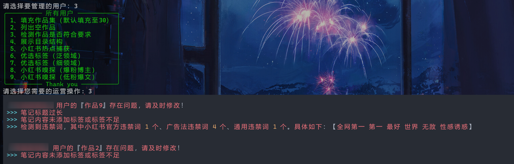
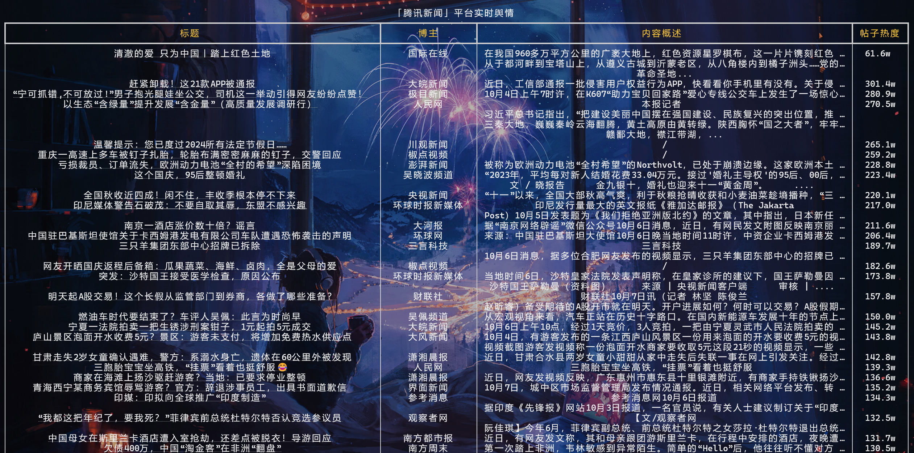
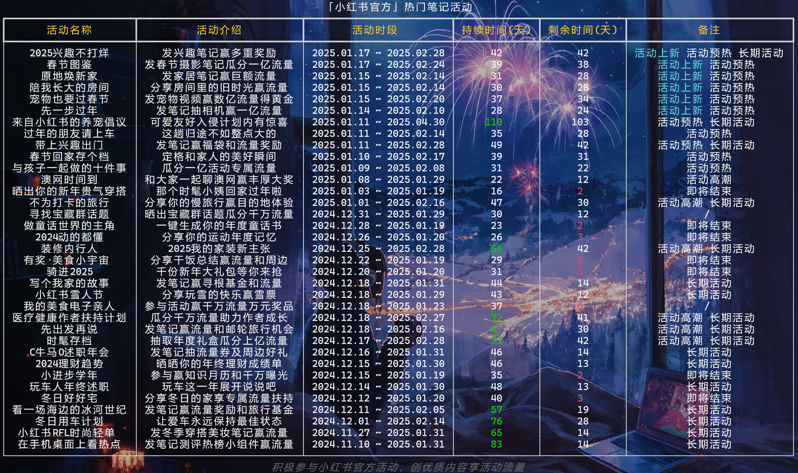
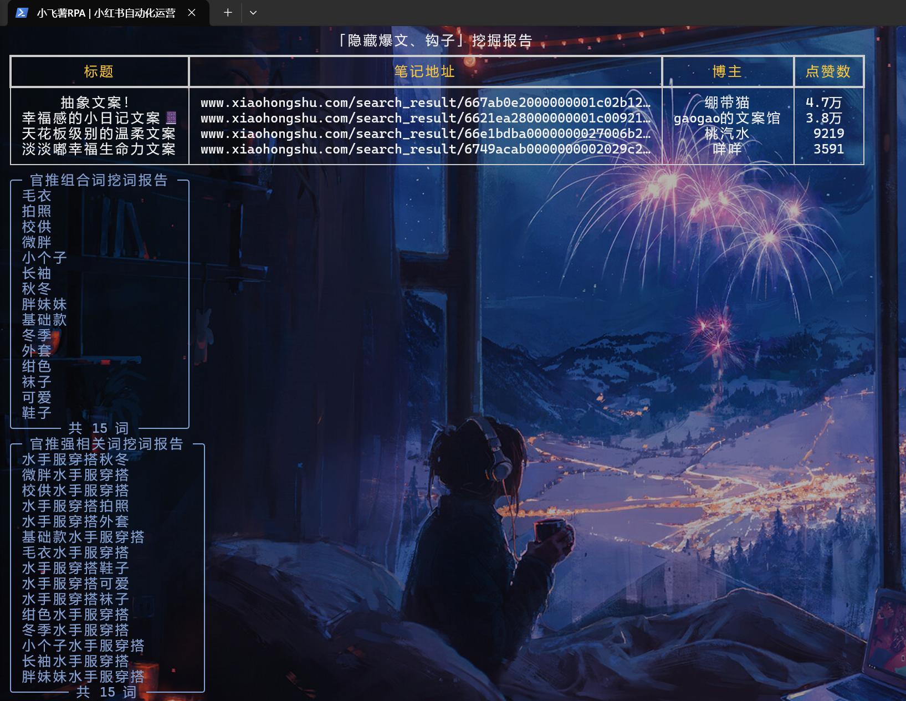
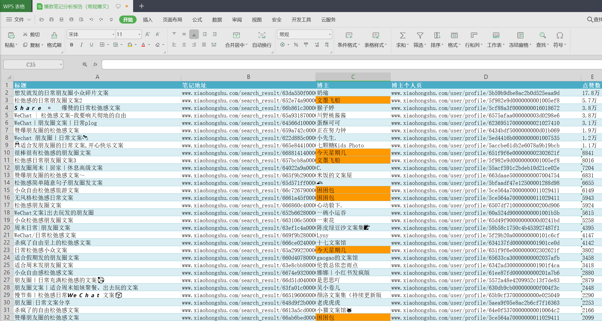
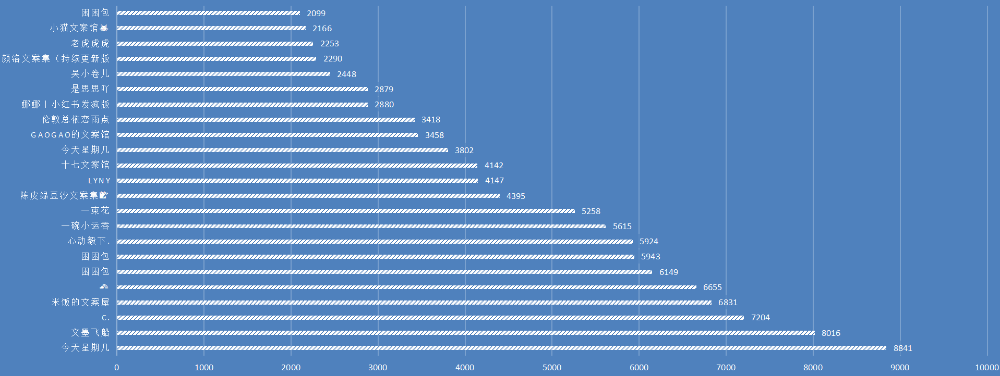
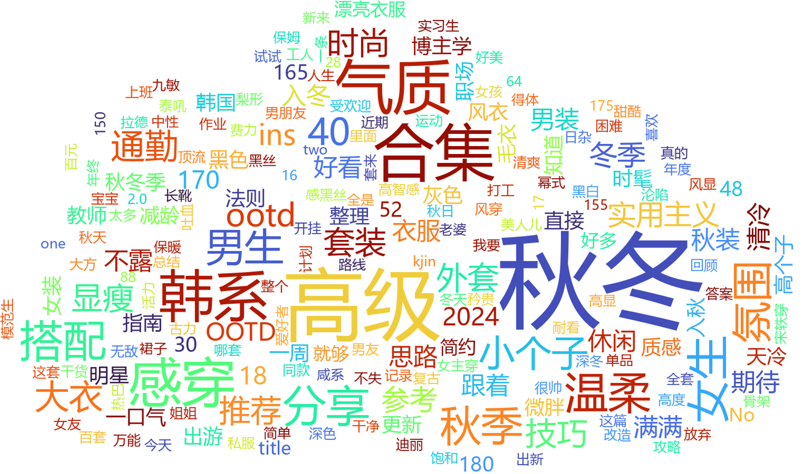
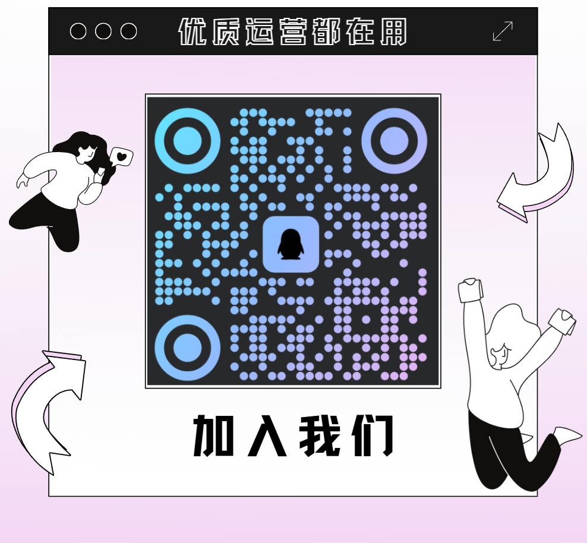
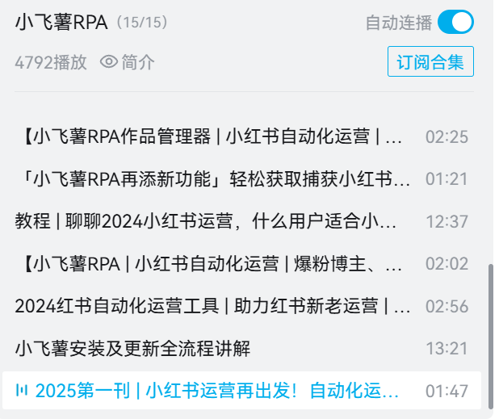
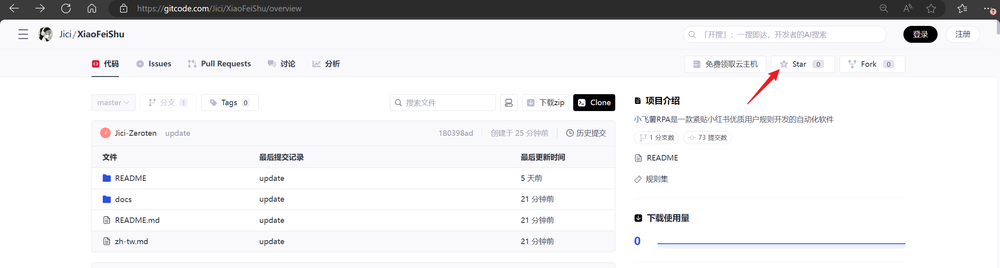

# 💕小飞薯RPA基本介绍


[『简体中文』介绍](README.md)  [『正體中文』介紹](zh-tw.md)

🌟 小红书晚进场新人救星！✨ 新人养号必备！🚀小红书运营自动化工作流解决方案！🔑专注小红书自动化！

📱 小飞薯RPA是一款紧贴小红书优质用户规则开发的自动化软件，💥提供了一套小红书运营自动化工作流解决方案，🎯避免了传统RPA机械化、规则化、易被检测的问题。💡 软件易上手，运行方式简单，功能强大。💪





















更多视频演示：

- [小飞薯RPA🌟小红书晚进场新人救星！✨ 新人养号必备！🔑专注小红书自动化！_哔哩哔哩_bilibili](https://www.bilibili.com/video/BV1ep8oeJEww/)
- [🌟小红书新人养号 | 小飞薯RPA多账号演示📱_哔哩哔哩_bilibili](https://www.bilibili.com/video/BV1yqh6eZE1w/)
- [小红书运营必备 | 小红书自动化神器 | 小红书笔记自动提交_哔哩哔哩_bilibili](https://www.bilibili.com/video/BV1Ya8bezEr4/)
- [小飞薯RPA作品管理器 | 小红书自动化运营｜自带小红书热点分析｜你的笔记创作好帮手！_哔哩哔哩_bilibili](https://www.bilibili.com/video/BV1wsi7eTEte/)
- [小飞薯RPA🌟轻松捕获小红书热点信息！🔑小红书优选标签！助力每一位小红书博主！_哔哩哔哩_bilibili](https://www.bilibili.com/video/BV1tcYmeWE2q/)
- [小飞薯RPA | 小红书自动化运营 | 爆粉博主、低粉爆文一键嗅探，轻松掌握竞品信息，对标笔记一手掌握！_哔哩哔哩_bilibili](https://www.bilibili.com/video/BV1Qgs4e7EtW/)
- [2024小红书自动化运营工具 | 助力红书新老运营 | 小飞薯舆情监控器功能演示_哔哩哔哩_bilibili](https://www.bilibili.com/video/BV13h2nYKEYM/)
- [2025小飞薯RPA第一刊 | 小红书运营再出发！自动化运营从0到1！_哔哩哔哩_bilibili](https://www.bilibili.com/video/BV1LFfnY6E9b/)

# 💻小飞薯RPA官方网址

小飞薯RPA唯一官方网址：[小飞薯RPA官方 | XiaoFeiShu RPA Official Website](https://jici-zeroten.github.io/XiaoFeiShu/)

必应搜索/谷歌搜索关键字`小飞薯RPA官网`即可直达


# 🤖小飞薯RPA软件功能

✅ 自动活跃账号（观看笔记/评论、点赞笔记/评论、收藏笔记等操作)

✅ 自动精准评论

✅ 自动流量换量（完成双向奔赴、抱团取暖等操作）

✅ 自动发布笔记（支持定时发布、多账号笔记独立管理、笔记违规检测等操作）

✅ 小红书热点分析

✅ 小红书优选标签

✅ 小红书流量嗅探

✅ 小红书数据分析（爆粉博主、低粉爆文等）

✅ 社会舆情监控（支持实时舆情监控、舆情大数据可视化分析、多模态模型分析、舆情报告局域网共享）

✅ 小红书笔记选题灵感（官方笔记活动、优质选题池等）

✅ 小红书SEO（智能挖词、好词优选、相关词联想、领域热词、官推组合词、官推强相关词等）

✅ 小红书定向领域爆文挖掘（常规爆款、隐藏爆款、钩子等）

# 💖小飞薯RPA软件亮点

- 安装简单：仅需简单两步操作就能完成部署，打破技术壁垒，不懂计算机的小白也能轻松使用
- 手册完备：配有详细的软件使用手册和对应的视频演示讲解，杜绝模棱两可，让你快速上手
- 轻量化：专注小红书自动化，避免无用/无关/无效内容导致的软件臃肿，软件体积小、占用资源少，轻松实现托管养号
- 运营理论与软件开发深度结合：软件全部功能开发均在多名小红书职业运营人士指导下完成，有强大运营理论支撑，贴合运营实战工作流，结合使用多个数据分析模型，拒绝无脑开发/空想开发、拒绝无用功能
- 无感化：软件运行在后台，养号全程无感，不影响日常设备正常使用，解决传统自动化软件霸占设备的短板，释放你的生产力工具
- 功能强大：模块化设计，具备观看、点赞、收藏、换量、发布等一系列功能，彻底结束四处求赞、四处评论活跃账号的网络流民生活
- 不易检测：完全模拟真实用户操作，并带有技术手段规避检测措施，拒绝机械化，规避传统自动化软件特征明显、易被检测的问题
- 平台友好：属于正规运营软件，软件所有操作均属于用户正常操作所产生的流量或数据扰动，没有任何刷取平台流量的行为，也不获取小红书平台数据，同时也不会给小红书支撑平台造成负担。拒绝黑灰产暴力软件对小红书及其支撑平台的侵害，兼顾用户友好、平台友好的双赢局面
- 规则精确：基于小红书流量规则，通过分析广大优质用户行为习惯，结合小红书专业运营师多年养号、陪跑经验而设计的高度贴合小红书优质账号规则，让用户更专注于优质内容创作
- 优质社群：构建新人优质社群，更加适合晚进场新人小白之间交流互助，扩展你的小红书人脉。社群分享小红书运营相关优质资料，帮助新人快速成长和了解行业动向
- 更新活跃：直面软件开发者，手把手教你安装、使用，有问题1对1解决，有bug、有需求、有想法均能及时反馈，并不断增加新功能

# ❓小飞薯RPA问答专区

Q：小飞薯RPA能否增加我笔记的流量？

A：小飞薯RPA是一款小红书自动化软件，这并不意味着能给你带来流量（流量规则是小红书定的，用户不得干预），但是结合我们的优质社群，你能够更好地进行流量换量（即双向奔赴、抱团取暖），那么从这个角度来说，是可以增加你笔记的流量的。

Q：小飞薯RPA内置的规则是否合理，会不会导致账号限流？

A：内置规则是通过技术手段分析小红书流量趋势、通过专业运营师经验总结、通过大量账号实践而设计的，并且不断保持更新，在遵循《小飞薯RPA使用手册》的前提下不会导致限流。

Q：小飞薯RPA有无安全问题，会不会导致账号被盗？

A：小飞薯RPA通过用户手机扫码登录，中途不涉及密码输入，且账号数据保存在用户设备本地并定时清除重置，此外还使用设备一机一码绑定机制，无法转载传播使用，没有任何账号泄露问题。

Q：使用小飞薯RPA会不会被检测，导致封号？

A：小飞薯RPA通过模拟真实点击实现自动化，和真人特征高度吻合，且无任何刷取流量的违规操作，符合小红书用户守则，仅仅只是一个快捷工具，不存在封号问题。

Q：我的小红书已经违规被限流了，能通过小飞薯RPA养号养回来吗？

A：根据小红书用户规则，限流程度取决于违规程度，如果是轻微违规所导致的限流，是可以通过养号提升账号权重的，但如果是严重违规所导致的限流，无论是人工养还是软件养，都是无法通过养号养回来的。再次申明，小飞薯RPA只能帮你完成自动化操作。

Q：小飞薯RPA多用户版本和单用户版本有什么区别？

A：单用户版本只能运营一个号，多用户版本可以运营多个号。

Q：我有多个账号，但我想用单用户版本的小飞薯RPA，我自己手动切换账号，可以吗？

A：根据小红书用户规则，账号频繁切换会被检测导致降权（是针对账号的检测，和软件无关），手动切换账号当然没问题，但是属于无效养号，不推荐这样钻牛角尖的做法。

Q：使用多用户版本的小飞薯RPA，但我只开一个号的话会有什么问题吗？

A：没有任何问题。

Q：启动小飞薯RPA后，窗口能不能最小化？

A：小飞薯RPA采用无感化设计，运行在设备后台，窗口可以最小化，不影响日常设备正常使用。

Q：启动小飞薯RPA后，电脑能不能锁屏，就是Win + L锁定屏幕这种？

A：小飞薯RPA采用无感化设计，运行在设备后台，电脑可以锁屏，不影响软件运行。

Q：我不太懂电脑，请问小飞薯RPA带使用说明吗？

A：小飞薯RPA有完备的使用手册，软件极易上手，不懂计算机的小白也能轻松使用。

Q：环境配置难吗？

A：小飞薯RPA不需要配置环境，无需搭配任何其他软件，即使是新装的系统/全新的电脑也能轻松运行。

Q：捐赠后可以长期使用吗？

A：捐赠后获得软件使用权，可以长期使用，直至团队退出服务为止。

Q：后续更新是否还需另外捐赠？

A：一次捐赠后获得软件使用权，持续享受更新内容。

Q：支持的Mac系统吗？

A：目前企业公司和工作室用的电脑基本都是Windows，对Mac版本的需求量很少，暂不考虑发布Mac版本。

Q：虚拟机能用吗？

A：为保障账号安全性，小飞薯RPA所有操作均需核实用户身份及其设备，虚拟机是无法通过审核的。

Q：请问小红书专业号可以使用吗？

A：小飞薯提供的是一套小红书运营自动化通用解决方案，个人号、品牌号、专业号、商家号、企业号均可使用。

Q：为什么软件老是更新？

A：小飞薯是实实在在投放到运营实战中的产品，每天被大量运营公司和工作室高强度使用，软件所有设计理念和用户规则完全贴合运营实战场景与平台，针对运营实战中的反馈数据不断迭代优化，更新是为了使用户得到最新最优的服务体验。

Q：国际版小红书REDnote可以用吗？

A：可以，小飞薯提供的是一套小红书运营自动化通用解决方案，平台是一致的，不区分。

------

更多问题？请看视频解答：

- [🌟2024小红书晚进场新人救星| 小红书自动化 | 小飞薯RPA详细介绍📱_哔哩哔哩_bilibili](https://www.bilibili.com/video/BV1xehSeQEKf/?spm_id_from=333.999.0.0)
- [聊聊2024小红书运营，什么用户适合小飞薯RPA，自媒体新手新人博主如何立足，从起号到运营，痛点分析，满满干货_哔哩哔哩_bilibili](https://www.bilibili.com/video/BV1t3pdepEkR/?spm_id_from=333.999.0.0&vd_source=0ad5d97e690d971211839f275274ce02)

# 📢小飞薯RPA原则和底线

🌟 **小飞薯：为博主创作提供高效支持** 🌟

小飞薯团队致力于提升用户运营效率，鼓励、引导、辅助博主创作符合小红书平台标准的优质内容，🌈从而为平台及其用户带来双赢的优质服务体验！💡携手共建繁荣的小红书星球！🌍

🚫 **严惩恶意行为，保护平台生态** 🚫

对于数据获取、引流截流、流量刷取等恶意黑灰产行为，小飞薯坚决说“不”！⚔️我们将守护平台的纯净环境，维护每一位用户的权益！💪黑灰产人士免开尊口！🤐

# 🍀小飞薯RPA社群氛围及用户评价

> 世界很大显得我们很渺小，很庆幸互联网让我们有机会相遇，再次感谢选择并支持小飞薯RPA的创作者们！
>


# 💓小飞薯RPA软件获取

🐧软件咨询交流群：`979372676` ，也可扫码进群，如下



> 为防止广告、水军，群聊由AI机器人自动审核入群，请确保QQ资质无误，欢迎你的加入。
>
> 此外，该群仅作分流咨询，完成『免费试用』或『友情捐赠』后，可进入对应小飞薯RPA优质用户社群。

## 免费试用

~~前`10`名加入社群的小伙伴免费获得软件，群等级 `Lv60` 以上（包括`Lv60`）也可以免费拿软件（单用户版本/多用户版本小飞薯RPA任选）~~

目前，前`10`名小伙伴免费试用名额已经全部发放完成。

此外，有部分小伙伴反映【群等级 `Lv60` 以上】太难了，现删除此规则，想要免费试用的小伙伴可以按照新的规则（任选其一即可）：

1. ~~访问我们的BiliBili小飞薯视频合集，如下
    [🌟专注小红书自动化 | 小红书运营福音 |小飞薯RPA视频合集_|小红书晚进场新人救星 哔哩哔哩_bilibili📱](https://www.bilibili.com/video/BV1LFfnY6E9b)~~

    

    ~~或者B站直接搜索关键字『小飞薯』『小飞薯RPA』。即可直达我们的视频，如下~~

    

    

    ~~视频合集存放的是小飞薯RPA软件介绍、更新、演示等系列视频，__选择最新发布的3个或3个以上视频，每个视频做【点赞 + 投币 + 收藏 + 评论或弹幕（小飞薯yyds！）】操作，截图联系群主__，即可获得免费试用~~

 2. __在抖音、快手、微信视频号、西瓜视频、今日头条等任一自媒体平台发布我们小飞薯的1个宣传视频（宣传视频群里文件有名为【宣传视频.zip】，解压即可获得），持续曝光两日及以上__，并在描述栏目添加如下描述：

    ```
    小飞薯RPA官网：https://jici-zeroten.github.io/XiaoFeiShu/
    项目地址：
      - GitHub（国际）：https://github.com/Jici-Zeroten/XiaoFeiShu
      - Gitee（国内）：https://gitee.com/Jici_Zeroten/XiaoFeiShu
      - Gitcode（国内）：https://gitcode.com/Jici/XiaoFeiShu/
    小飞薯RPA交流群：979372676
    ```

    __截图联系群主__，即可获得免费试用

 3. __转发小飞薯的宣传文案【项目截图 + 项目地址 + 文字描述 】至2个或2个以上人数达到50人的行业相关群聊（QQ、微信、钉钉、飞书均可，广告群/冷群/寂静群不算），截图联系群主__，即可获得免费试用。类似下图

    > 请注意，在分享、宣传、推荐时，你应该遵守的原则是『客观评价，真心推荐，尽最大限度避免给行业相关群聊造成困扰』。过于生硬或不和谐植入的，造成行业相关群聊困扰的，最终导致损毁抹黑小飞薯产品形象的，工作人员将有权拒绝提供试用。

    

    

 4. **邀请码试用**：小飞薯RPA团队会给`一些优质的运营人士/团队、频道主、UP主、博文主`以及`每个小飞薯优质用户社群`发放专属邀请码，如果你获得了他（她）们的邀请码，**可以联系群主并告知邀请码**，凭邀请码免费试用软件。觉得好用的、有意捐赠的，可凭邀请码减免捐赠金额（见下方「友情捐赠」栏目）

    > 同时，也欢迎相关人士联系我们进行自荐，生成专属邀请码，促进行业交流合作

 5. **社会爱心公益人士试用**：如果你是热爱公益事业的人士，**可以联系群主出具公益相关证书（纸质/电子证书均可）**，凭证书免费试用软件。目前支持平台有：`韩红爱心慈善基金会`、`腾讯公益`、`支付寶公益`。

## 友情捐赠

关于定价捐赠，一方面是表达你对我们小飞薯的认可，另一方面是为了筛选优质用户从而打造优质社群。

有句话，免费的就是最贵的，相信你也不想有蛀米虫混入优质社群中，设置门槛也是为了给小飞薯用户带来优质的服务体验【优质社群里的同志都是经过门槛筛选的、和你一样性质的人，所以社群有多少含金量可以自行思考】。

觉得小飞薯不错的，需要通过捐赠获得软件使用权的小伙伴可以参考以下任一途径：

> 📢 公益项目捐赠属于个人用户捐赠行为，以下捐赠金额均指最低门槛值，旨在划分和筛选用户

> 📢 校企/公司/机构/工作室等实体组织如需采购软件，可联系小飞薯RPA相关工作人员说明来意，并告知对应组织名、工号、职务，方便后续洽谈以跟进商业采购合同

1. **直接捐赠**：`小飞薯RPA(单用户版本)`捐赠~~60~~ 80，`小飞薯RPA(多用户版本)`捐赠~~80~~ 100，价格按产品经济曲线随人数上涨而上涨

2. __项目地址【[GitHub](https://github.com/Jici-Zeroten/XiaoFeiShu)、[Gitee](https://gitee.com/Jici_Zeroten/XiaoFeiShu)、[GitCode](https://gitcode.com/Jici/XiaoFeiShu/overview)】对小飞薯项目进行【Star + Follow（关注）作者 】，截图联系群主__，即可八折获得软件， 即捐赠~~48~~ 64(单用户版本)/捐赠~~64~~ 80(多用户版本)

3. **邀请码减免**：小飞薯RPA团队会给`一些优质的运营人士/团队、频道主、UP主、博文主`以及`每个小飞薯优质用户社群`发放专属邀请码，如果你获得了他（她）们的邀请码，**可以联系群主并告知邀请码**，凭邀请码捐赠可八折获得软件， 即捐赠~~48~~ 64(单用户版本)/捐赠~~64~~ 80(多用户版本)

4. **拼单减免**：有3个及以上用户同时捐赠的，**联系并告知群主和你拼单的小伙伴名单**，每个人可七折获得软件，即捐赠~~42~~ 56(单用户版本)/捐赠~~56~~ 70(多用户版本)

5. 本项目已经加入《大学生创业帮扶计划》，**如果你是毕业2年内的大学生或在校大学生，可以通过以下【任一途径】并联系群主，八折获得软件**（即捐赠~~48~~ 64(单用户版本)/捐赠~~64~~ 80(多用户版本)）：

   > 📢 截至今日，小飞薯RPA项目已助力国内外15+所高校（含10+所高等院校、3+所专科院校、2+所职业院校）的优质创作者们，感谢认可与支持🎉🎉

   - 提供由[中国高等教育学生信息网(学信网)](https://www.chsi.com.cn/)生成的《教育部学籍在线验证报告》
   - 提供所读大学的校园邮箱，完成校园邮箱验证
   - 提供所读大学的录取通知书+学生证/校园卡合拍照片
   - 出具《大学生创业团队证明材料》纸质材料（需要团队负责老师签名），并提供大学生创业团队负责老师联系方式
   - 出具所读大学相关毕业证明，如毕业生资质证明、学位证书、毕业证书、学信档案等

   > 注意，若学生认证材料中涉及敏感信息的请自行打码，仅用作身份识别

# 🍧捐赠码

小飞薯RPA的开发也是倾注了我们很多精力的，一开始只是为了圈内人士使用方便，因为这样能够把更多的时间花在优质内容创作上，之后发现帮了我们很多忙，觉得挺好用的，于是决定分享出来大家一起用！

> 毕竟在平台上发还是要按照平台流量规则来，很多时候也许你的内容优质但是流量规则是机械的，因为平台用户很多，酒香也怕巷子深，这也导致新人小白很难立足，这也是我们建立社群的初心。

## 微信


## 支付寶


# ❤️我们的用户&捐赠特别鸣谢

排名沒有先後之分，每隔30日自動同步最新記錄，真心感謝各位支援！！！

| 捐赠者              | 渠道   | 时间                 |
| ------------------- | ------ | -------------------- |
| **焕                | 支付寶 | 2025年02月16日 00:13 |
| *🔥                  | 微信   | 2025年02月16日 00:18 |
| ARMY                | 微信   | 2025年02月16日 05:35 |
| 米肖绣圕            | 微信   | 2025年02月16日 07:04 |
| M*a                 | 微信   | 2025年02月16日 10:22 |
| 夙凰                | 微信   | 2025年02月17日 16:01 |
| 多多                | 支付寶 | 2025年02月18日 09:29 |
| *烜                 | 支付寶 | 2025年02月18日 12:32 |
| **志                | 支付寶 | 2025年02月18日 15:41 |
| 毅颗小果果          | 微信   | 2025年02月19日 12:05 |
| *亨                 | 微信   | 2025年02月19日 14:25 |
| 刁钻古怪本怪        | 微信   | 2025年02月21日 07:10 |
| 无敌stefan          | 微信   | 2025年02月22日 14:14 |
| *雷                 | 支付寶 | 2025年02月22日 19:22 |
| 一二三              | 支付寶 | 2025年02月23日 12:41 |
| *七                 | 微信   | 2025年02月24日 10:45 |
| 大熊星座的尾巴尖    | 微信   | 2025年02月24日 10:47 |
| *丘                 | 微信   | 2025年02月24日 15:47 |
| *诤                 | 支付寶 | 2025年02月25日 21:39 |
| *游                 | 微信   | 2025年02月26日 11:12 |
| *瑛                 | 微信   | 2025年02月26日 18:27 |
| 小卷卷🍓             | 微信   | 2025年02月26日 19:58 |
| 愤怒米米世界66      | 支付寶 | 2025年02月27日 18:54 |
| *蒙                 | 支付寶 | 2025年02月27日 21:55 |
| *K                  | 微信   | 2025年02月28日 15:04 |
| R*.                 | 微信   | 2025年03月01日 15:16 |
| *生                 | 微信   | 2025年03月01日 19:22 |
| *月                 | 微信   | 2025年03月01日 20:29 |
| 唐舒殊              | 微信   | 2025年03月01日 23:59 |
| Candy               | 支付寶 | 2025年03月02日 03:14 |
| 万事通小姐格兰杰... | 微信   | 2025年03月03日 22:14 |
| *琪                 | 支付寶 | 2025年03月04日 11:55 |
| 姽婳                | 支付寶 | 2025年03月05日 06:00 |
| *丁                 | 微信   | 2025年03月05日 09:36 |
| E*y                 | 微信   | 2025年03月05日 10:07 |
| T*M                 | 微信   | 2025年03月05日 17:09 |
| *光                 | 微信   | 2025年03月06日 15:52 |
| *7                  | 微信   | 2025年03月07日 14:46 |
| 涧生菖蒲            | 微信   | 2025年03月07日 18:26 |
| *中                 | 微信   | 2025年03月08日 11:35 |
| *左                 | 微信   | 2025年03月08日 19:12 |
| 豆豆毯              | 微信   | 2025年03月08日 23:30 |
| 且听风吟            | 支付寶 | 2025年03月09日 09:23 |
| G*e                 | 微信   | 2025年03月09日 17:42 |
| 两只小凶许📷         | 微信   | 2025年03月10日 04:00 |
| 雨夜                | 支付寶 | 2025年03月10日 08:13 |
| *北                 | 微信   | 2025年03月10日 19:43 |
| 稀刺平触            | 微信   | 2025年03月11日 15:26 |
| LuckyKoala          | 微信   | 2025年03月12日 05:09 |
| *绮                 | 支付寶 | 2025年03月12日 16:50 |
| F*s                 | 微信   | 2025年03月12日 17:13 |
| 曦晗&瑾             | 支付寶 | 2025年03月13日 05:34 |
| Yoly                | 支付寶 | 2025年03月14日 12:28 |
| *门                 | 微信   | 2025年03月14日 16:21 |
| *次                 | 微信   | 2025年03月14日 16:22 |
| *晨                 | 微信   | 2025年03月15日 18:07 |
| Momo                | 微信   | 2025年03月15日 19:00 |
| **彭                | 支付寶 | 2025年03月15日 23:10 |
