# 💕小飛薯RPA基本介紹

[『简体中文』介绍](README.md)  [『正體中文』介紹](zh-tw.md)

🌟 小紅書晚進場新人救星！✨ 新人養號必備！🚀小紅書運營自動化工作流解決方案！🔑專注小紅書自動化！

📱 小飛薯RPA是一款緊貼小紅書優質使用者規則開發的自動化軟體，💥提供了一套小紅書運營自動化工作流解決方案，🎯避免了傳統RPA機械化、規則化、易被檢測的問題。💡 軟體易上手，執行方式簡單，功能強大。💪

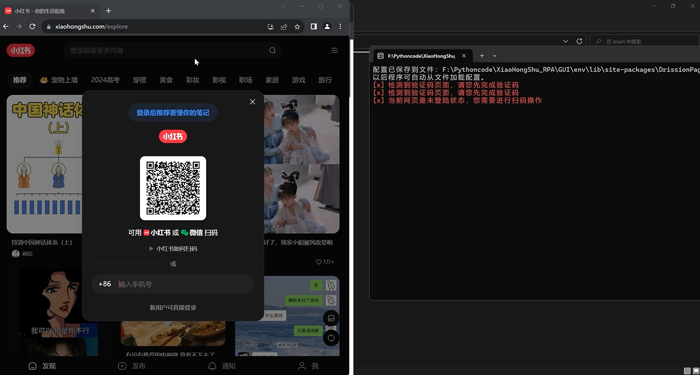

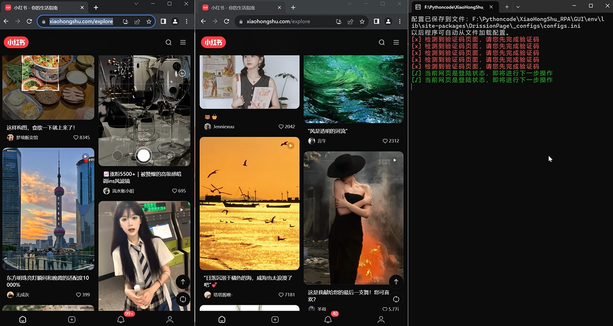

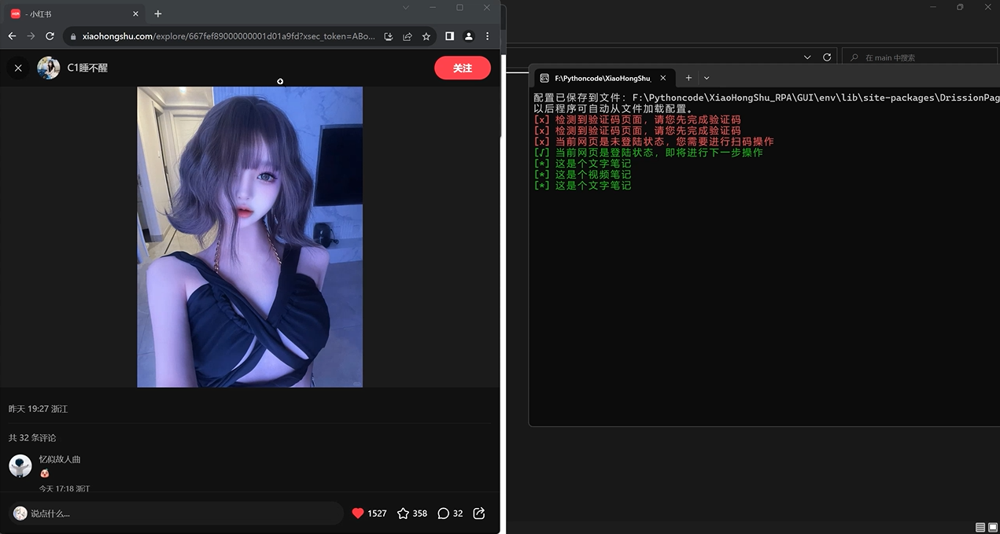

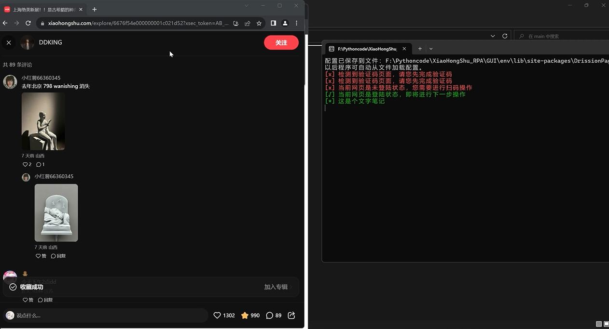

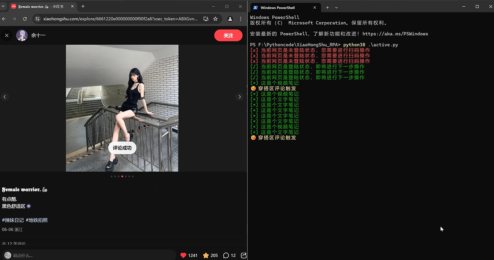

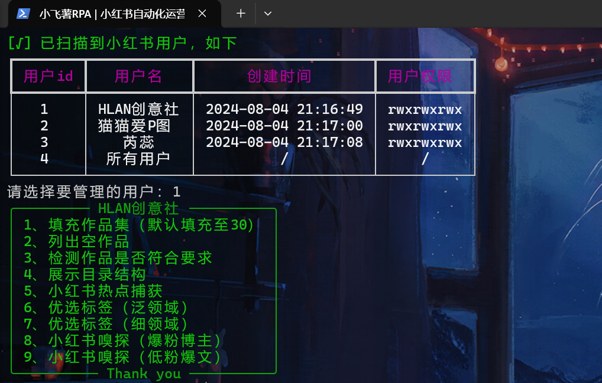

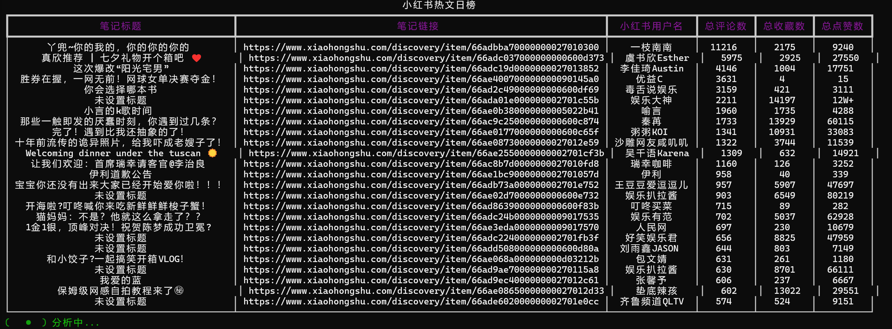

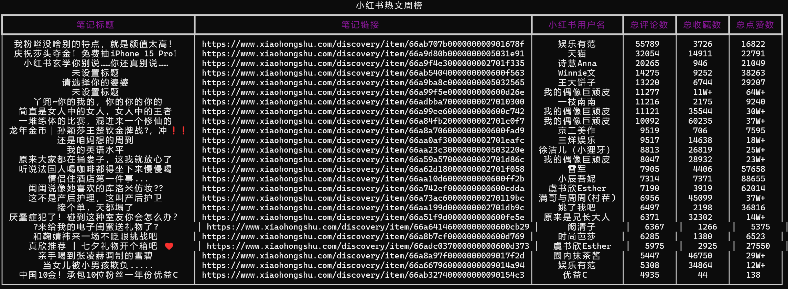

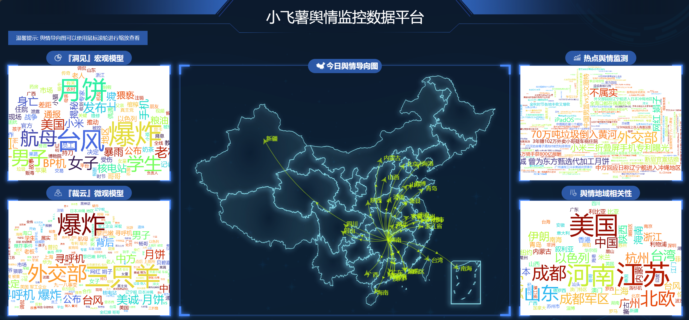

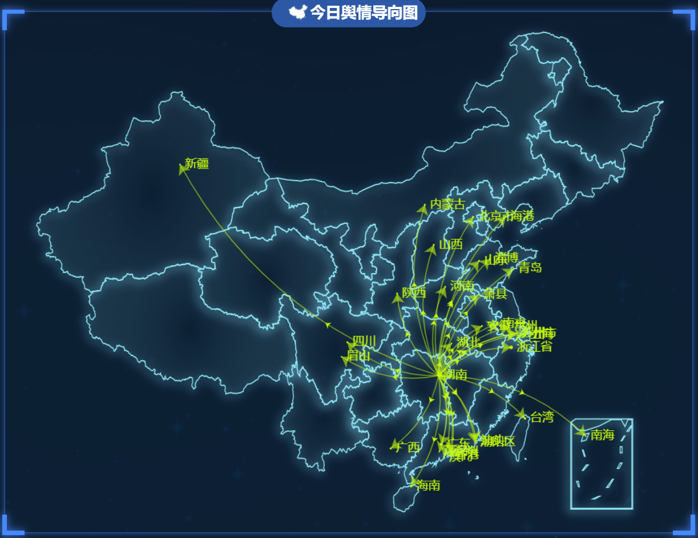

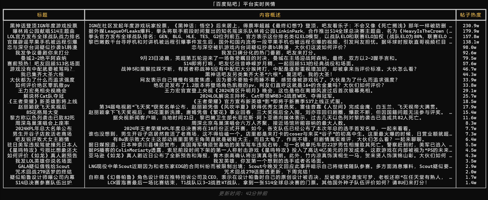

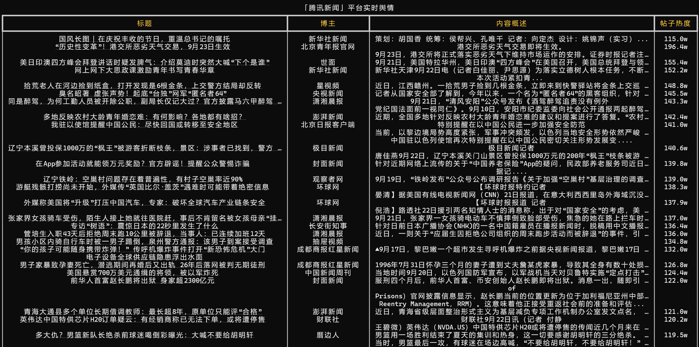

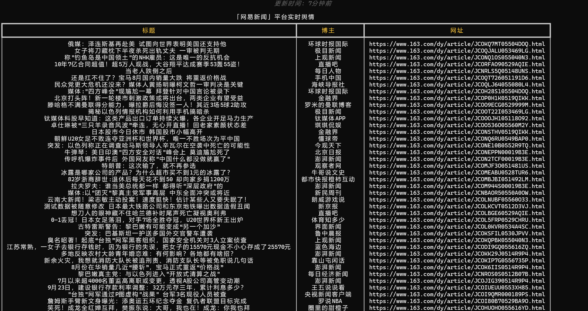

更多影片演示：

- [小飛薯RPA🌟小紅書晚進場新人救星！✨ 新人養號必備！🔑專注小紅書自動化！_嗶哩嗶哩_bilibili](https://www.bilibili.com/video/BV1ep8oeJEww/)
- [🌟小紅書新人養號 | 小飛薯RPA多賬號演示📱_嗶哩嗶哩_bilibili](https://www.bilibili.com/video/BV1yqh6eZE1w/)
- [小紅書運營必備 | 小紅書自動化神器 | 小紅書筆記自動提交_嗶哩嗶哩_bilibili](https://www.bilibili.com/video/BV1Ya8bezEr4/)
- [小飛薯RPA作品管理器 | 小紅書自動化運營｜自帶小紅書熱點分析｜你的筆記創作好幫手！_嗶哩嗶哩_bilibili](https://www.bilibili.com/video/BV1wsi7eTEte/?spm_id_from=333.999.0.0)
- [小飛薯RPA🌟輕鬆捕獲小紅書熱點資訊！🔑小紅書優選標籤！助力每一位小紅書博主！_嗶哩嗶哩_bilibili](https://www.bilibili.com/video/BV1tcYmeWE2q/?spm_id_from=333.999.0.0)
- [小飛薯RPA | 小紅書自動化運營 | 爆粉博主、低粉爆文一鍵嗅探，輕鬆掌握競品資訊，對標筆記一手掌握！_嗶哩嗶哩_bilibili](https://www.bilibili.com/video/BV1Qgs4e7EtW/?spm_id_from=333.1007.0.0)

# 💻小飛薯RPA官方網址

小飛薯RPA唯一官方網址：[小飛薯RPA官方 | XiaoFeiShu RPA Official Website](https://jici-zeroten.github.io/XiaoFeiShu/)

必應谷歌搜尋/谷歌搜尋關鍵字`小飛薯RPA官網`即可直達

# 🤖小飛薯RPA軟體功能

✅ 自動活躍賬號（觀看筆記/評論、點贊筆記/評論、收藏筆記等操作)

✅ 自動精準評論

✅ 自動流量換量（完成雙向奔赴、抱團取暖等操作）

✅ 自動釋出筆記（支援定時釋出、多賬號筆記獨立管理、筆記違規檢測等操作）

✅ 小紅書熱點分析

✅ 小紅書優選標籤

✅ 小紅書流量嗅探

✅ 小紅書資料分析（爆粉博主、低粉爆文等）

✅ 社會輿情監控（支援即時輿情監控、輿情大資料視覺化分析、多模態模型分析、公司區域網共享）

# 💖小飛薯RPA軟體亮點

- 安裝簡單：僅需簡單兩步操作就能完成部署，打破技術壁壘，不懂計算機的小白也能輕鬆使用
- 手冊完備：配有詳細的軟體使用手冊和對應的影片演示講解，杜絕模稜兩可，讓你快速上手
- 輕量化：專注小紅書自動化，避免無用/無關/無效內容導致的軟體臃腫，軟體體積小、佔用資源少，輕鬆實現託管養號
- 運營理論與軟體開發深度結合：軟體全部功能開發均在多名小紅書職業運營人士指導下完成，有強大運營理論支撐，貼合運營實戰工作流，結合使用多個數據分析模型，拒絕無腦開發/空想開發、拒絕無用功能
- 無感化：軟體執行在後臺，養號全程無感，不影響日常裝置正常使用，解決傳統自動化軟體霸佔裝置的短板，釋放您的生產力工具
- 功能強大：模組化設計，具備觀看、點贊、收藏、換量、釋出等一系列功能，徹底結束四處求贊、四處評論活躍賬號的網路流民生活
- 不易檢測：完全模擬真實使用者操作，並帶有技術手段規避檢測措施，拒絕機械化，規避傳統自動化軟體特徵明顯、易被檢測的問題
- 規則精確：基於小紅書流量規則，透過分析廣大優質使用者行為習慣，結合小紅書專業運營師多年養號、陪跑經驗而設計的高度貼合小紅書優質賬號規則，讓使用者更專注於優質內容創作
- 優質社群：構建新人優質社群，更加適合晚進場新人小白之間交流互助，擴充套件你的小紅書人脈。社群分享小紅書運營相關優質資料，幫助新人快速成長和了解行業動向
- 更新活躍：直面軟體開發者，手把手教你安裝、使用，有問題1對1解決，有bug、有需求、有想法均能及時反饋，並不斷增加新功能

# ❓小飛薯RPA問答專區

Q：小飛薯RPA能否增加我筆記的流量？

A：小飛薯RPA是一款小紅書自動化軟體，這並不意味之能給你帶來流量（流量規則是小紅書定的，使用者不得干預），但是結合我們的優質社群，你能夠更好地進行流量換量（即雙向奔赴、抱團取暖），那麼從這個角度來說，是可以增加你筆記的流量的。

Q：小飛薯RPA內建的規則是否合理，會不會導致賬號限流？

A：內建規則是透過技術手段分析小紅書流量趨勢、透過專業運營師經驗總結、透過大量賬號實踐而設計的，並且不斷保持更新，在遵循《小飛薯RPA使用手冊》的前提下不會導致限流。

Q：小飛薯RPA有無安全問題，會不會導致賬號被盜？

A：小飛薯RPA透過使用者手機掃碼登入，中途不涉及密碼輸入，且賬號資料儲存在使用者裝置本地並定時清除重置，此外還使用裝置一機一碼繫結機制，無法轉載傳播使用，沒有任何賬號洩露問題。

Q：使用小飛薯RPA會不會被檢測，導致封號？

A：小飛薯RPA透過模擬真實點選實現自動化，和真人特徵高度吻合，且無任何刷取流量的違規操作，符合小紅書使用者守則，僅僅只是一個快捷工具，不存在封號問題。

Q：我的小紅書已經違規被限流了，能透過小飛薯RPA養號養回來嗎？

A：根據小紅書使用者規則，限流程度取決於違規程度，如果是輕微違規所導致的限流，是可以透過養號提升賬號權重的，但如果是嚴重違規所導致的限流，無論是人工養還是軟體養，都是無法透過養號養回來的。再次申明，小飛薯RPA只能幫您完成自動化操作。

Q：小飛薯RPA多使用者版本和單使用者版本有什麼區別？

A：單使用者版本只能運營一個號，多使用者版本可以運營多個號。

Q：我有多個賬號，但我想用單使用者版本的小飛薯RPA，我自己手動切換賬號，可以嗎？

A：根據小紅書使用者規則，賬號頻繁切換會被檢測導致降權（是針對賬號的檢測，和軟體無關），手動切換賬號當然沒問題，但是屬於無效養號，不推薦這樣鑽牛角尖的做法。

Q：使用多使用者版本的小飛薯RPA，但我只開一個號的話會有什麼問題嗎？

A：沒有任何問題。

Q：啟動小飛薯RPA後，視窗能不能最小化？

A：小飛薯RPA採用無感化設計，執行在裝置後臺，視窗可以最小化，不影響日常裝置正常使用。

Q：啟動小飛薯RPA後，電腦能不能鎖屏，就是Win + L鎖定螢幕這種？

A：小飛薯RPA採用無感化設計，執行在裝置後臺，電腦可以鎖屏，不影響軟體執行。

Q：我不太懂電腦，請問小飛薯RPA帶使用說明嗎？

A：小飛薯RPA有完備的使用手冊，軟體極易上手，不懂計算機的小白也能輕鬆使用。

Q：環境配置難嗎？

A：小飛薯RPA不需要配置環境，無需搭配任何其他軟體，即使是新裝的系統/全新的電腦也能輕鬆執行。

------

更多問題？請看影片解答：

- [🌟2024小紅書晚進場新人救星| 小紅書自動化 | 小飛薯RPA詳細介紹📱_嗶哩嗶哩_bilibili](https://www.bilibili.com/video/BV1xehSeQEKf/?spm_id_from=333.999.0.0)
- [聊聊2024小紅書運營，什麼使用者適合小飛薯RPA，自媒體新手新人博主如何立足，從起號到運營，痛點分析，滿滿乾貨_嗶哩嗶哩_bilibili](https://www.bilibili.com/video/BV1t3pdepEkR/?spm_id_from=333.999.0.0&vd_source=0ad5d97e690d971211839f275274ce02)

# 🍀小飛薯RPA社群氛圍及使用者評價

以下聊天記錄均經使用者同意釋出，再次感謝選擇小飛薯RPA。

# 💓小飛薯RPA軟體獲取

🐧軟體諮詢交流群：`979372676` ，也可掃碼進群，如下

> 為防止廣告、水軍，群聊由AI機器人自動稽核入群，請確保QQ資質無誤，歡迎您的加入。
>
> 此外，該群僅作分流諮詢，完成『免費試用』或『友情捐助』後，可進入對應小飛薯RPA優質使用者社群。

## 免費試用

~~前`10`名小夥伴免費獲得軟體，群等級 `Lv60` 以上（包括`Lv60`）也可以免費拿軟體（單使用者版本/多使用者版本小飛薯RPA任選）~~

目前，前`10`名小夥伴免費試用名額已經全部發放完成。

此外，有部分小夥伴反映【群等級 `Lv60` 以上】太難了，現刪除此規則，想要免費試用的小夥伴可以按照新的規則（任選其一即可）：

1. 訪問我們的BiliBili小飛薯影片合集，如下
    [🌟專注小紅書自動化 | 小紅書運營福音 |小飛薯RPA影片合集_|小紅書晚進場新人救星 嗶哩嗶哩_bilibili📱](https://www.bilibili.com/video/BV1Qgs4e7EtW/)

    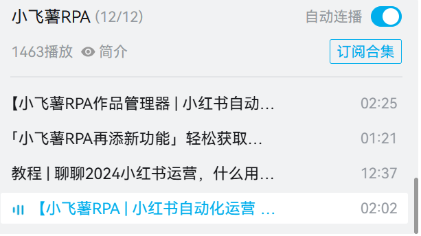

    或者B站直接搜尋關鍵字『小飛薯』『小飛薯RPA』。即可直達我們的影片，如下

    

    

    影片合集存放的是小飛薯RPA軟體介紹、更新、演示等系列影片，__任選3個或3個以上影片，每個影片做【點贊 + 投幣 + 收藏 + 評論或彈幕（小飛薯yyds！）】操作，截圖聯絡群主__，即可獲得免費試用

 2. __在抖音、快手、微信影片號、西瓜影片、今日頭條等任一自媒體平臺釋出我們小飛薯的1個宣傳影片（宣傳影片群裡檔案有名為【宣傳影片.zip】，解壓即可獲得），持續曝光兩日及以上__，並在描述欄目新增如下描述：

    - 專案地址
    - gitee（國內）：https://gitee.com/Jici_Zeroten/XiaoFeiShu

    - github（國外）：https://github.com/Jici-Zeroten/XiaoFeiShu

    - 小飛薯RPA交流群：979372676

    截圖聯絡群主，即可獲得免費試用

 3. __轉發小飛薯的宣傳文案【專案截圖 + 專案地址 + 文字描述 】至2個或2個以上人數達到50人的群聊（QQ、微信、釘釘、飛書均可，廣告群不算），截圖聯絡群主__，即可獲得免費試用。類似下圖

    

 4. **邀請碼試用**：小飛薯RPA團隊會給`一些優質的運營人士/團隊、頻道主、UP主、博文主`以及`每個小飛薯優質使用者社群`發放專屬邀請碼，如果你獲得了他（她）們的邀請碼，**可以聯絡群主並告知邀請碼**，憑邀請碼免費試用軟體。覺得好用的、有意捐助的，可憑邀請碼減免捐助金額（見下方「友情捐助」欄目）

    > 同時，也歡迎相關人士聯絡我們進行自薦，生成專屬邀請碼，促進行業交流合作

## 友情捐助

關於定價捐助，一方面是表達您對我們小飛薯的認可，另一方面是為了篩選優質使用者從而打造優質社群，有句話，免費的就是最貴的，相信您也不想有蛀米蟲混入優質社群中，設定門檻也是為了給小飛薯使用者帶來優質的服務體驗。覺得小飛薯不錯的，需要透過捐助獲得軟體使用權的小夥伴可以參考以下任一途徑：

1. **直接捐助**：`小飛薯RPA(單使用者版本)`捐助 ~~30~~ 50，`小飛薯RPA(多使用者版本)`捐助 ~~50~~ 70，價格按產品經濟曲線隨人數上漲而上漲
2. __專案地址【gitee、github】對小飛薯專案進行【star + Follow（關注）作者 】，截圖聯絡群主__，即可八折獲得軟體， 即捐助~~24~~ 40(單使用者版本)/捐助~~40~~ 56(多使用者版本)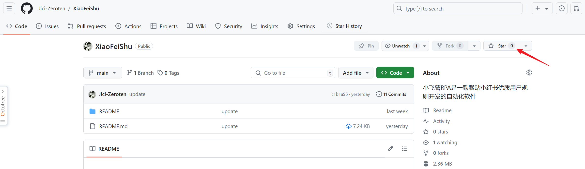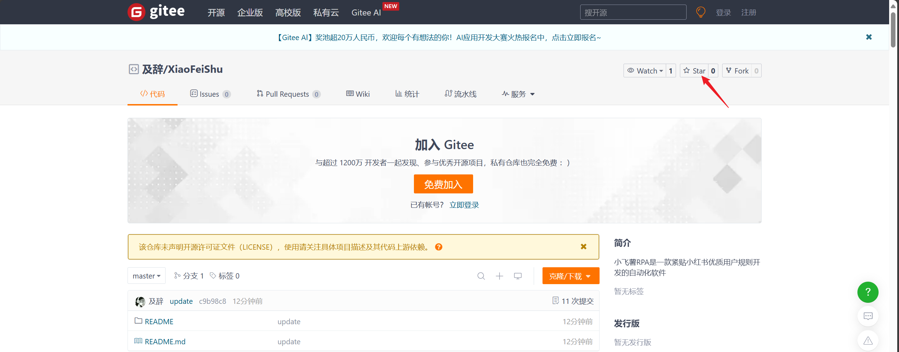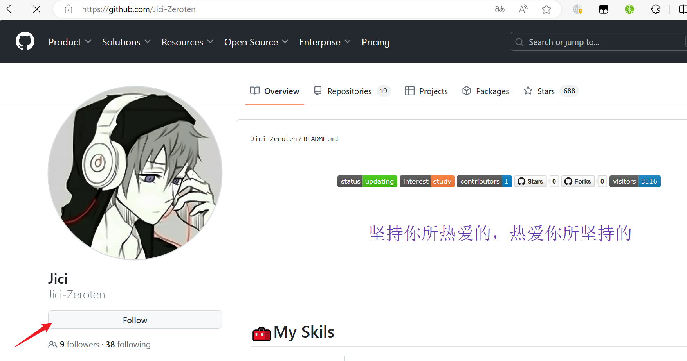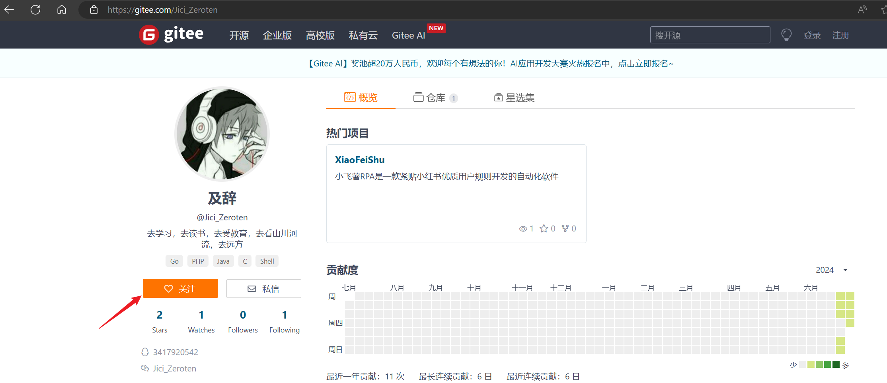
3. **邀請碼減免**：小飛薯RPA團隊會給`一些優質的運營人士/團隊、頻道主、UP主、博文主`以及`每個小飛薯優質使用者社群`發放專屬邀請碼，如果你獲得了他（她）們的邀請碼，**可以聯絡群主並告知邀請碼**，憑邀請碼捐助可八折獲得軟體， 即捐助~~24~~ 40(單使用者版本)/捐助~~40~~ 56(多使用者版本)
4. **拼單減免**：有3個及以上使用者同時捐助的，**聯絡並告知群主和你拼單的小夥伴名單**，每個人可七折獲得軟體，即捐助~~21~~ 35(單使用者版本)/捐助~~35~~ 49(多使用者版本)
5. 本專案已經加入《大學生創業幫扶計劃》，**如果你是畢業2年內的大學生或在校大學生，可以透過以下【任一途徑】並聯系群主，半價獲得軟體**（即捐助~~15~~ 25(單使用者版本)/捐助~~25~~ 35(多使用者版本)）：
   - 提供所讀大學的校園郵箱，完成校園郵箱驗證
   - 提供所讀大學的錄取通知書+學生證/校園卡合拍照片（敏感資訊可打碼，僅用作身份識別）
   - 出具《大學生創業團隊證明材料》紙質材料（需要團隊負責老師簽名），並提供大學生創業團隊負責老師聯絡方式
   - 出具所讀大學相關畢業證明，如畢業生資質證明、學位證書、畢業證書等（敏感資訊可打碼，僅用作身份識別）

# 🍧捐助碼

小飛薯RPA的開發也是傾注了我們很多精力的，一開始只是為了圈內人士使用方便，因為這樣能夠把更多的時間花在優質內容創作上，之後發現幫了我們很多忙，覺得挺好用的，於是決定分享出來大家一起用！

> 畢竟在平臺上發還是要按照平臺流量規則來，很多時候也許你的內容優質但是流量規則是機械的，因為平臺使用者很多，酒香也怕巷子深，這也導致新人小白很難立足，這也是我們建立社群的初心。

## 微信

## 支付寶

# ❤️我们的用户&捐助特别鸣谢

排名没有先后之分，每隔20日自动同步最新记录，真心感谢各位支持！！！

| 捐助者                | 渠道   | 时间                 |
| :-------------------- | :----- | :------------------- |
| 在水一方              | 支付寶 | 2024年09月05日 00:39 |
| 陈不住气              | 支付寶 | 2024年09月05日 01:41 |
| 天涯环卫工            | 微信   | 2024年09月07日 19:48 |
| 鸢晨雾                | 微信   | 2024年09月09日 02:19 |
| Simida                | 支付寶 | 2024年09月09日 02:45 |
| 风中奇缘              | 微信   | 2024年09月09日 10:02 |
| 果然是那样            | 微信   | 2024年09月10日 01:18 |
| n55！                 | 微信   | 2024年09月10日 01:50 |
| 你也是一只猫          | 微信   | 2024年09月10日 09:27 |
| 萬物無邪              | 支付寶 | 2024年09月10日 15:16 |
| zzz夏天全职代吃冰激凌 | 微信   | 2024年09月11日 03:41 |
| Nikolai               | 微信   | 2024年09月11日 10:42 |
| Hopelessly apathetic  | 微信   | 2024年09月11日 14:15 |
| 国国                  | 微信   | 2024年09月12日 12:01 |
| 书生老矣              | 支付寶 | 2024年09月12日 21:45 |
| 抵制小日子            | 微信   | 2024年09月13日 03:07 |
| 一朵老可爱            | 微信   | 2024年09月13日 13:11 |
| 大毛                  | 微信   | 2024年09月14日 14:18 |
| 是贝贝吖              | 微信   | 2024年09月14日 18:28 |
| Try everything        | 微信   | 2024年09月15日 02:38 |
| 般源居士              | 微信   | 2024年09月15日 05:12 |
| 文火炖蘑菇            | 微信   | 2024年09月15日 19:53 |
| 连雨                  | 微信   | 2024年09月16日 07:19 |
| 毛崽阿毛崽            | 微信   | 2024年09月16日 09:55 |
| 曲小桃                | 微信   | 2024年09月17日 03:56 |
| 只願君心似我心丶      | 微信   | 2024年09月17日 16:06 |
| 鹤慕x                 | 微信   | 2024年09月17日 22:39 |
| 须臾.                 | 支付寶 | 2024年09月18日 02:47 |
| ｀殘c                 | 微信   | 2024年09月18日 18:32 |
| 锦江近西烟水绿        | 微信   | 2024年09月19日 11:44 |
| BōBō                  | 微信   | 2024年09月20日 20:28 |
| 情迷果冻海            | 微信   | 2024年09月21日 20:30 |
| 艾克斯                | 微信   | 2024年09月21日 23:37 |
| Villain.              | 微信   | 2024年09月22日 21:32 |
| 默                    | 微信   | 2024年09月23日 12:24 |
| 沈绾妤妤              | 微信   | 2024年09月23日 12:30 |
| 又见南山              | 微信   | 2024年09月24日 10:41 |
