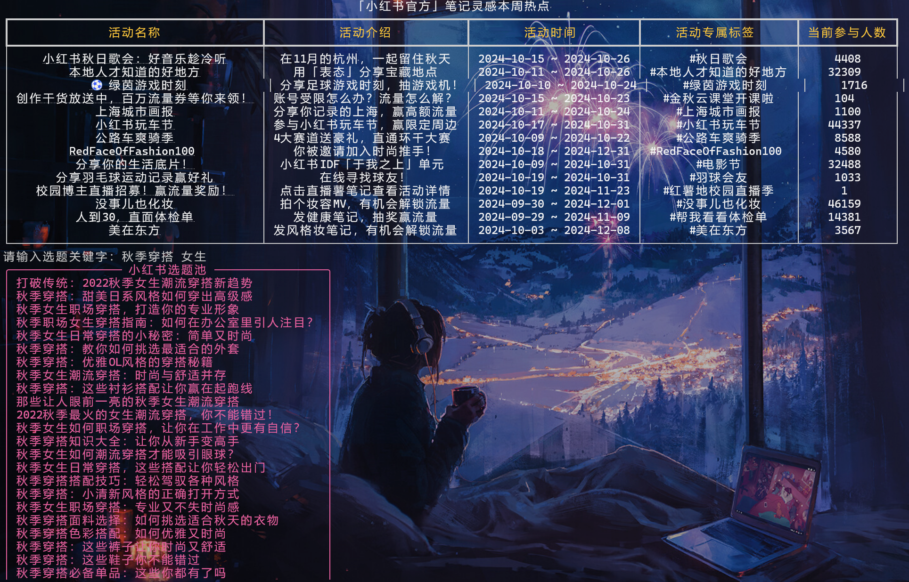
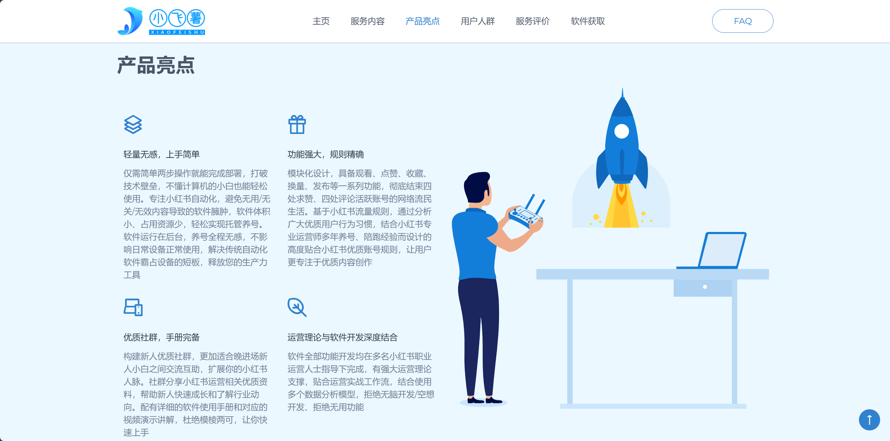

# 💕小飛薯RPA基本介紹


[『简体中文』介绍](README.md)  [『正體中文』介紹](zh-tw.md)

🌟 小紅書晚進場新人救星！✨ 新人養號必備！🚀小紅書運營自動化工作流解決方案！🔑專注小紅書自動化！

📱 小飛薯RPA是一款緊貼小紅書優質使用者規則開發的自動化軟體，💥提供了一套小紅書運營自動化工作流解決方案，🎯避免了傳統RPA機械化、規則化、易被檢測的問題。💡 軟體易上手，執行方式簡單，功能強大。💪





更多影片演示：

- [小飛薯RPA🌟小紅書晚進場新人救星！✨ 新人養號必備！🔑專注小紅書自動化！_嗶哩嗶哩_bilibili](https://www.bilibili.com/video/BV1ep8oeJEww/)
- [🌟小紅書新人養號 | 小飛薯RPA多賬號演示📱_嗶哩嗶哩_bilibili](https://www.bilibili.com/video/BV1yqh6eZE1w/)
- [小紅書運營必備 | 小紅書自動化神器 | 小紅書筆記自動提交_嗶哩嗶哩_bilibili](https://www.bilibili.com/video/BV1Ya8bezEr4/)
- [小飛薯RPA作品管理器 | 小紅書自動化運營｜自帶小紅書熱點分析｜你的筆記創作好幫手！_嗶哩嗶哩_bilibili](https://www.bilibili.com/video/BV1wsi7eTEte/)
- [小飛薯RPA🌟輕鬆捕獲小紅書熱點資訊！🔑小紅書優選標籤！助力每一位小紅書博主！_嗶哩嗶哩_bilibili](https://www.bilibili.com/video/BV1tcYmeWE2q/)
- [小飛薯RPA | 小紅書自動化運營 | 爆粉博主、低粉爆文一鍵嗅探，輕鬆掌握競品資訊，對標筆記一手掌握！_嗶哩嗶哩_bilibili](https://www.bilibili.com/video/BV1Qgs4e7EtW/)
- [2024小紅書自動化運營工具 | 助力紅書新老運營 | 小飛薯輿情監控器功能演示_嗶哩嗶哩_bilibili](https://www.bilibili.com/video/BV13h2nYKEYM/)
- [2025小飛薯RPA第一刊 | 小紅書運營再出發！自動化運營從0到1！_嗶哩嗶哩_bilibili](https://www.bilibili.com/video/BV1LFfnY6E9b/)

# 💻小飛薯RPA官方網址

小飛薯RPA唯一官方網址：[小飛薯RPA官方 | XiaoFeiShu RPA Official Website](https://jici-zeroten.github.io/XiaoFeiShu/)

必應搜尋/谷歌搜尋關鍵字`小飛薯RPA官網`即可直達




# 🤖小飛薯RPA軟體功能

✅ 自動活躍賬號（觀看筆記/評論、點贊筆記/評論、收藏筆記等操作)

✅ 自動精準評論

✅ 自動流量換量（完成雙向奔赴、抱團取暖等操作）

✅ 自動釋出筆記（支援定時釋出、多賬號筆記獨立管理、筆記違規檢測等操作）

✅ 小紅書熱點分析

✅ 小紅書優選標籤

✅ 小紅書流量嗅探

✅ 小紅書資料分析（爆粉博主、低粉爆文等）

✅ 社會輿情監控（支援即時輿情監控、輿情大資料視覺化分析、多模態模型分析、輿情報告區域網共享）

✅ 小紅書筆記選題靈感（官方筆記活動、優質選題池等）

✅ 小紅書SEO（智慧挖詞、好詞優選、相關詞聯想、領域熱詞、官推組合詞、官推強相關詞等）

✅ 小紅書定向領域爆文挖掘（常規爆款、隱藏爆款、鉤子等）

# 💖小飛薯RPA軟體亮點

- 安裝簡單：僅需簡單兩步操作就能完成部署，打破技術壁壘，不懂計算機的小白也能輕鬆使用
- 手冊完備：配有詳細的軟體使用手冊和對應的影片演示講解，杜絕模稜兩可，讓你快速上手
- 輕量化：專注小紅書自動化，避免無用/無關/無效內容導致的軟體臃腫，軟體體積小、佔用資源少，輕鬆實現託管養號
- 運營理論與軟體開發深度結合：軟體全部功能開發均在多名小紅書職業運營人士指導下完成，有強大運營理論支撐，貼合運營實戰工作流，結合使用多個數據分析模型，拒絕無腦開發/空想開發、拒絕無用功能
- 無感化：軟體執行在後臺，養號全程無感，不影響日常裝置正常使用，解決傳統自動化軟體霸佔裝置的短板，釋放你的生產力工具
- 功能強大：模組化設計，具備觀看、點贊、收藏、換量、釋出等一系列功能，徹底結束四處求贊、四處評論活躍賬號的網路流民生活
- 不易檢測：完全模擬真實使用者操作，並帶有技術手段規避檢測措施，拒絕機械化，規避傳統自動化軟體特徵明顯、易被檢測的問題
- 平臺友好：屬於正規運營軟體，軟體所有操作均屬於使用者正常操作所產生的流量或資料擾動，沒有任何刷取平臺流量的行為，也不獲取小紅書平臺數據，同時也不會給小紅書支撐平臺造成負擔。拒絕黑灰產暴力軟體對小紅書及其支撐平臺的侵害，兼顧使用者友好、平臺友好的雙贏局面
- 規則精確：基於小紅書流量規則，透過分析廣大優質使用者行為習慣，結合小紅書專業運營師多年養號、陪跑經驗而設計的高度貼合小紅書優質賬號規則，讓使用者更專注於優質內容創作
- 優質社群：構建新人優質社群，更加適合晚進場新人小白之間交流互助，擴充套件你的小紅書人脈。社群分享小紅書運營相關優質資料，幫助新人快速成長和了解行業動向
- 更新活躍：直面軟體開發者，手把手教你安裝、使用，有問題1對1解決，有bug、有需求、有想法均能及時反饋，並不斷增加新功能

# ❓小飛薯RPA問答專區

Q：小飛薯RPA能否增加我筆記的流量？

A：小飛薯RPA是一款小紅書自動化軟體，這並不意味著能給你帶來流量（流量規則是小紅書定的，使用者不得干預），但是結合我們的優質社群，你能夠更好地進行流量換量（即雙向奔赴、抱團取暖），那麼從這個角度來說，是可以增加你筆記的流量的。

Q：小飛薯RPA內建的規則是否合理，會不會導致賬號限流？

A：內建規則是透過技術手段分析小紅書流量趨勢、透過專業運營師經驗總結、透過大量賬號實踐而設計的，並且不斷保持更新，在遵循《小飛薯RPA使用手冊》的前提下不會導致限流。

Q：小飛薯RPA有無安全問題，會不會導致賬號被盜？

A：小飛薯RPA透過使用者手機掃碼登入，中途不涉及密碼輸入，且賬號資料儲存在使用者裝置本地並定時清除重置，此外還使用裝置一機一碼繫結機制，無法轉載傳播使用，沒有任何賬號洩露問題。

Q：使用小飛薯RPA會不會被檢測，導致封號？

A：小飛薯RPA透過模擬真實點選實現自動化，和真人特徵高度吻合，且無任何刷取流量的違規操作，符合小紅書使用者守則，僅僅只是一個快捷工具，不存在封號問題。

Q：我的小紅書已經違規被限流了，能透過小飛薯RPA養號養回來嗎？

A：根據小紅書使用者規則，限流程度取決於違規程度，如果是輕微違規所導致的限流，是可以透過養號提升賬號權重的，但如果是嚴重違規所導致的限流，無論是人工養還是軟體養，都是無法透過養號養回來的。再次申明，小飛薯RPA只能幫你完成自動化操作。

Q：小飛薯RPA多使用者版本和單使用者版本有什麼區別？

A：單使用者版本只能運營一個號，多使用者版本可以運營多個號。

Q：我有多個賬號，但我想用單使用者版本的小飛薯RPA，我自己手動切換賬號，可以嗎？

A：根據小紅書使用者規則，賬號頻繁切換會被檢測導致降權（是針對賬號的檢測，和軟體無關），手動切換賬號當然沒問題，但是屬於無效養號，不推薦這樣鑽牛角尖的做法。

Q：使用多使用者版本的小飛薯RPA，但我只開一個號的話會有什麼問題嗎？

A：沒有任何問題。

Q：啟動小飛薯RPA後，視窗能不能最小化？

A：小飛薯RPA採用無感化設計，執行在裝置後臺，視窗可以最小化，不影響日常裝置正常使用。

Q：啟動小飛薯RPA後，電腦能不能鎖屏，就是Win + L鎖定螢幕這種？

A：小飛薯RPA採用無感化設計，執行在裝置後臺，電腦可以鎖屏，不影響軟體執行。

Q：我不太懂電腦，請問小飛薯RPA帶使用說明嗎？

A：小飛薯RPA有完備的使用手冊，軟體極易上手，不懂計算機的小白也能輕鬆使用。

Q：環境配置難嗎？

A：小飛薯RPA不需要配置環境，無需搭配任何其他軟體，即使是新裝的系統/全新的電腦也能輕鬆執行。

Q：捐贈後可以長期使用嗎？

A：捐贈後獲得軟體使用權，可以長期使用，直至團隊退出服務為止。

Q：後續更新是否還需另外捐贈？

A：一次捐贈後獲得軟體使用權，持續享受更新內容。

Q：支援的Mac系統嗎？

A：目前企業公司和工作室用的電腦基本都是Windows，對Mac版本的需求量很少，暫不考慮釋出Mac版本。

Q：虛擬機器能用嗎？

A：為保障賬號安全性，小飛薯RPA所有操作均需核實使用者身份及其裝置，虛擬機器是無法透過稽核的。

Q：請問小紅書專業號可以使用嗎？

A：小飛薯提供的是一套小紅書運營自動化通用解決方案，個人號、品牌號、專業號、商家號、企業號均可使用。

Q：為什麼軟體老是更新？

A：小飛薯是實實在在投放到運營實戰中的產品，每天被大量運營公司和工作室高強度使用，軟體所有設計理念和使用者規則完全貼合運營實戰場景與平臺，針對運營實戰中的反饋資料不斷迭代最佳化，更新是為了使使用者得到最新最優的服務體驗。

Q：國際版小紅書REDnote可以用嗎？

A：可以，小飛薯提供的是一套小紅書運營自動化通用解決方案，平臺是一致的，不區分。

------

更多問題？請看影片解答：

- [🌟2024小紅書晚進場新人救星| 小紅書自動化 | 小飛薯RPA詳細介紹📱_嗶哩嗶哩_bilibili](https://www.bilibili.com/video/BV1xehSeQEKf/?spm_id_from=333.999.0.0)
- [聊聊2024小紅書運營，什麼使用者適合小飛薯RPA，自媒體新手新人博主如何立足，從起號到運營，痛點分析，滿滿乾貨_嗶哩嗶哩_bilibili](https://www.bilibili.com/video/BV1t3pdepEkR/?spm_id_from=333.999.0.0&vd_source=0ad5d97e690d971211839f275274ce02)

# 📢小飛薯RPA原則和底線

🌟 **小飛薯：為博主創作提供高效支援** 🌟

小飛薯團隊致力於提升使用者運營效率，鼓勵、引導、輔助博主創作符合小紅書平臺標準的優質內容，🌈從而為平臺及其使用者帶來雙贏的優質服務體驗！💡攜手共建繁榮的小紅書星球！🌍

🚫 **嚴懲惡意行為，保護平臺生態** 🚫

> 📣 截至今日，小飛薯團隊共計識別、打擊、拒絕、駁回、上報涉小紅書平臺的黑灰產侵害行為70+個

對於資料獲取、引流截流、流量刷取等惡意黑灰產行為，小飛薯堅決說“不”！⚔️我們將守護平臺的純淨環境，維護每一位使用者的權益！💪黑灰產人士免開尊口！🤐

💥**專設【小黑屋】欄目，重拳出擊不良行為**👊

為此我們在[官方網站](https://jici-zeroten.github.io/XiaoFeiShu/index.html)設立的【小黑屋】專欄，展現部分違規使用者處置公告，🍉[戳此，直達圍觀](https://jici-zeroten.github.io/XiaoFeiShu/BanRoom.html)👀


# 🍀小飛薯RPA社群氛圍及使用者評價

> 世界很大顯得我們很渺小，很慶幸網際網路讓我們有機會相遇，再次感謝選擇並支援小飛薯RPA的創作者們！
>


# 💓小飛薯RPA軟體獲取

🐧軟體諮詢交流群：`979372676` ，也可掃碼進群，如下


> 為防止廣告、水軍，群聊由AI機器人自動稽核入群，請確保QQ資質無誤，歡迎你的加入。
>
> 此外，該群僅作分流諮詢，完成『免費試用』或『友情捐贈』後，可進入對應小飛薯RPA優質使用者社群。

## 免費試用

~~前`10`名加入社群的小夥伴免費獲得軟體，群等級 `Lv60` 以上（包括`Lv60`）也可以免費拿軟體（單使用者版本/多使用者版本小飛薯RPA任選）~~

目前，前`10`名小夥伴免費試用名額已經全部發放完成。

此外，有部分小夥伴反映【群等級 `Lv60` 以上】太難了，現刪除此規則，想要免費試用的小夥伴可以按照新的規則（任選其一即可）：

1. ~~訪問我們的BiliBili小飛薯影片合集，如下
    [🌟專注小紅書自動化 | 小紅書運營福音 |小飛薯RPA影片合集_|小紅書晚進場新人救星 嗶哩嗶哩_bilibili📱](https://www.bilibili.com/video/BV1LFfnY6E9b)~~

    

    ~~或者B站直接搜尋關鍵字『小飛薯』『小飛薯RPA』。即可直達我們的影片，如下~~

    

    

    ~~影片合集存放的是小飛薯RPA軟體介紹、更新、演示等系列影片，__選擇最新發布的3個或3個以上影片，每個影片做【點贊 + 投幣 + 收藏 + 評論或彈幕（小飛薯yyds！）】操作，截圖聯絡群主__，即可獲得免費試用~~

 2. __在抖音、快手、微信影片號、西瓜影片、今日頭條等任一自媒體平臺釋出我們小飛薯的1個宣傳影片（宣傳影片群裡檔案有名為【宣傳影片.zip】，解壓即可獲得），持續曝光兩日及以上__，並在描述欄目新增如下描述：

    ```
    小飛薯RPA官網：https://jici-zeroten.github.io/XiaoFeiShu/
    專案地址：
      - GitHub（國際）：https://github.com/Jici-Zeroten/XiaoFeiShu
      - Gitee（國內）：https://gitee.com/Jici_Zeroten/XiaoFeiShu
      - Gitcode（國內）：https://gitcode.com/Jici/XiaoFeiShu/
    小飛薯RPA交流群：979372676
    ```

    __截圖聯絡群主__，即可獲得免費試用

 3. __轉發小飛薯的宣傳文案【專案截圖 + 專案地址 + 文字描述 】至2個或2個以上人數達到50人的行業相關群聊（QQ、微信、釘釘、飛書均可，廣告群/冷群/寂靜群不算），截圖聯絡群主__，即可獲得免費試用。類似下圖

    > 請注意，在分享、宣傳、推薦時，你應該遵守的原則是『客觀評價，真心推薦，盡最大限度避免給行業相關群聊造成困擾』。過於生硬或不和諧植入的，造成行業相關群聊困擾的，最終導致損毀抹黑小飛薯產品形象的，工作人員將有權拒絕提供試用。

    

    

 4. **邀請碼試用**：小飛薯RPA團隊會給`一些優質的運營人士/團隊、頻道主、UP主、博文主`以及`每個小飛薯優質使用者社群`發放專屬邀請碼，如果你獲得了他（她）們的邀請碼，**可以聯絡群主並告知邀請碼**，憑邀請碼免費試用軟體。覺得好用的、有意捐贈的，可憑邀請碼減免捐贈金額（見下方「友情捐贈」欄目）

    > 同時，也歡迎相關人士聯絡我們進行自薦，生成專屬邀請碼，促進行業交流合作

 5. **社會愛心公益人士試用**：如果你是熱愛公益事業的人士，**可以聯絡群主出具公益相關證書（紙質/電子證書均可）**，憑證書免費試用軟體。目前支援平臺有：`韓紅愛心慈善基金會`、`騰訊公益`、`支付寶公益`。

## 友情捐贈

關於定價捐贈，一方面是表達你對我們小飛薯的認可，另一方面是為了篩選優質使用者從而打造優質社群。

有句話，免費的就是最貴的，相信你也不想有蛀米蟲混入優質社群中，設定門檻也是為了給小飛薯使用者帶來優質的服務體驗【優質社群裡的同志都是經過門檻篩選的、和你一樣性質的人，所以社群有多少含金量可以自行思考】。

覺得小飛薯不錯的，需要透過捐贈獲得軟體使用權的小夥伴可以參考以下任一途徑：

> 📣 公益專案捐贈屬於個人使用者捐贈行為，以下捐贈金額均指最低門檻值，旨在劃分和篩選使用者

> 📣 校企/公司/機構/工作室等實體組織如需採購軟體，可聯絡小飛薯RPA相關工作人員說明來意，並告知對應組織名、工號、職務，方便後續洽談以跟進商業採購合同

1. **直接捐贈**：`小飛薯RPA(單使用者版本)`捐贈~~60~~ 80，`小飛薯RPA(多使用者版本)`捐贈~~80~~ 100，價格按產品經濟曲線隨人數上漲而上漲

2. __專案地址【[GitHub](https://github.com/Jici-Zeroten/XiaoFeiShu)、[Gitee](https://gitee.com/Jici_Zeroten/XiaoFeiShu)、[GitCode](https://gitcode.com/Jici/XiaoFeiShu/overview)】對小飛薯專案進行【Star + Follow（關注）作者 】，截圖聯絡群主__，即可八折獲得軟體， 即捐贈~~48~~ 64(單使用者版本)/捐贈~~64~~ 80(多使用者版本)

3. **邀請碼減免**：小飛薯RPA團隊會給`一些優質的運營人士/團隊、頻道主、UP主、博文主`以及`每個小飛薯優質使用者社群`發放專屬邀請碼，如果你獲得了他（她）們的邀請碼，**可以聯絡群主並告知邀請碼**，憑邀請碼捐贈可八折獲得軟體， 即捐贈~~48~~ 64(單使用者版本)/捐贈~~64~~ 80(多使用者版本)

4. **拼單減免**：有3個及以上使用者同時捐贈的，**聯絡並告知群主和你拼單的小夥伴名單**，每個人可七折獲得軟體，即捐贈~~42~~ 56(單使用者版本)/捐贈~~56~~ 70(多使用者版本)

5. 本專案已經加入《大學生創業幫扶計劃》，**如果你是畢業2年內的大學生或在校大學生，可以透過以下【任一途徑】並聯系群主，八折獲得軟體**（即捐贈~~48~~ 64(單使用者版本)/捐贈~~64~~ 80(多使用者版本)）：

   > 📣 截至今日，小飛薯RPA專案已助力國內外15+所高校（含10+所高等院校、3+所專科院校、2+所職業院校）的優質創作者們，感謝認可與支援🎉🎉

   - 提供由[中國高等教育學生資訊網(學信網)](https://www.chsi.com.cn/)生成的《教育部學籍線上驗證報告》
   - 提供所讀大學的校園郵箱，完成校園郵箱驗證
   - 提供所讀大學的錄取通知書+學生證/校園卡合拍照片
   - 出具《大學生創業團隊證明材料》紙質材料（需要團隊負責老師簽名），並提供大學生創業團隊負責老師聯絡方式
   - 出具所讀大學相關畢業證明，如畢業生資質證明、學位證書、畢業證書、學信檔案等

   > 注意，若學生認證材料中涉及敏感資訊的請自行打碼，僅用作身份識別

# 🍧捐贈碼

小飛薯RPA的開發也是傾注了我們很多精力的，一開始只是為了圈內人士使用方便，因為這樣能夠把更多的時間花在優質內容創作上，之後發現幫了我們很多忙，覺得挺好用的，於是決定分享出來大家一起用！

> 畢竟在平臺上發還是要按照平臺流量規則來，很多時候也許你的內容優質但是流量規則是機械的，因為平臺使用者很多，酒香也怕巷子深，這也導致新人小白很難立足，這也是我們建立社群的初心。

## 微信


## 支付寶


# ❤️我們的使用者&捐贈特別鳴謝

排名沒有先後之分，每隔30日自動同步最新記錄，真心感謝各位支援！！！

| 捐赠者         | 渠道   | 时间                 |
| -------------- | ------ | -------------------- |
| 不许乳我心肝   | 微信   | 2025年03月16日 10:56 |
| 姿er           | 微信   | 2025年03月17日 08:40 |
| *真            | 微信   | 2025年03月17日 09:47 |
| *强            | 支付寶 | 2025年03月17日 12:08 |
| F*s            | 微信   | 2025年03月17日 16:15 |
| *)             | 微信   | 2025年03月18日 13:36 |
| *麟            | 微信   | 2025年03月18日 13:49 |
| *坷            | 支付寶 | 2025年03月18日 14:38 |
| *瑶            | 微信   | 2025年03月18日 15:11 |
| iou酥屿妮      | 支付寶 | 2025年03月18日 19:41 |
| Rowin_L        | 微信   | 2025年03月19日 11:54 |
| A*h            | 微信   | 2025年03月19日 14:57 |
| *生            | 微信   | 2025年03月19日 16:48 |
| *刚            | 支付寶 | 2025年03月19日 21:55 |
| *。            | 微信   | 2025年03月19日 22:40 |
| ~*~            | 微信   | 2025年03月19日 22:47 |
| 考一个红薯     | 微信   | 2025年03月20日 05:24 |
| H*u            | 微信   | 2025年03月20日 16:10 |
| *0             | 微信   | 2025年03月21日 11:02 |
| Lesley°Baby    | 微信   | 2025年03月21日 18:35 |
| yi_ting        | 支付寶 | 2025年03月22日 04:01 |
| *卿            | 支付寶 | 2025年03月22日 17:03 |
| *去            | 微信   | 2025年03月22日 17:45 |
| *夜            | 微信   | 2025年03月22日 19:18 |
| *丹            | 支付寶 | 2025年03月22日 22:32 |
| yy（超幸福版） | 微信   | 2025年03月23日 18:09 |
| **凡           | 支付寶 | 2025年03月23日 20:49 |
| sun~zy         | 微信   | 2025年03月24日 07:20 |
| 勇敢一次！     | 微信   | 2025年03月25日 11:19 |
| 泡汤了一碗饭   | 支付寶 | 2025年03月26日 02:21 |
| **锋           | 支付寶 | 2025年03月26日 21:47 |
| 哥斯拉         | 微信   | 2025年03月27日 02:30 |
| *豪            | 微信   | 2025年03月27日 14:59 |
| *捷            | 支付寶 | 2025年03月28日 11:32 |
| *坷            | 支付寶 | 2025年03月28日 14:27 |
| *尔            | 微信   | 2025年03月28日 14:40 |
| E*y            | 微信   | 2025年03月28日 22:09 |
| 是小羊本杨啦   | 微信   | 2025年03月28日 23:40 |
| 板栗大王^      | 微信   | 2025年03月29日 15:11 |
| 银智媛         | 微信   | 2025年03月30日 17:34 |
| **凯           | 支付寶 | 2025年03月31日 10:47 |
| 左小葵         | 微信   | 2025年03月31日 18:55 |
| *梓            | 微信   | 2025年03月31日 20:59 |
| 斑斓冰芯包     | 微信   | 2025年04月01日 19:15 |
| igdvfjdn       | 微信   | 2025年04月02日 01:22 |
| *忠            | 微信   | 2025年04月02日 11:37 |
| **国           | 支付寶 | 2025年04月02日 15:48 |
| 墨冉           | 微信   | 2025年04月03日 07:07 |
| *·             | 微信   | 2025年04月03日 11:32 |
| *文            | 微信   | 2025年04月03日 21:42 |
| 回头是岸       | 支付寶 | 2025年04月04日 16:32 |
| *哥            | 微信   | 2025年04月05日 15:35 |
| *举            | 微信   | 2025年04月05日 18:56 |
| *冶            | 微信   | 2025年04月07日 10:08 |
| c*n            | 微信   | 2025年04月07日 22:51 |
| m*o            | 微信   | 2025年04月08日 08:34 |
| s*e            | 微信   | 2025年04月09日 13:54 |
| *+             | 微信   | 2025年04月11日 13:01 |
| *智            | 支付寶 | 2025年04月11日 16:02 |
| *°             | 微信   | 2025年04月12日 20:30 |
| _*i            | 微信   | 2025年04月15日 11:48 |
| *哒            | 微信   | 2025年04月15日 15:12 |
| R*y            | 微信   | 2025年04月15日 17:05 |
| *兵            | 支付寶 | 2025年04月15日 17:31 |
| I*y            | 微信   | 2025年04月15日 21:08 |
| K*Y            | 微信   | 2025年04月15日 21:44 |
| *桶            | 微信   | 2025年04月16日 10:55 |
